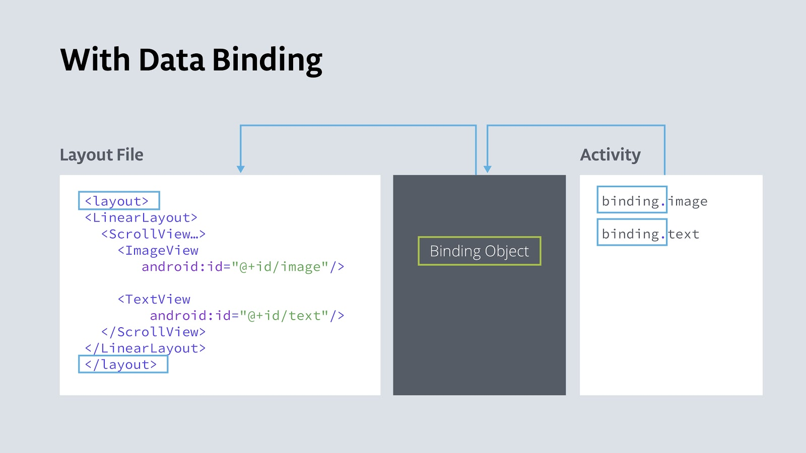
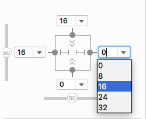
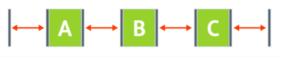
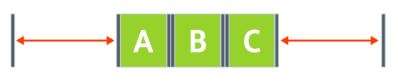

# Google CodeLabs: Android Kotlin Fundamental course

## How to use

Explanation given in comment format. Follow repos in order.

1. (HelloWorld)[/HelloWorld]: Dice roll app

   1. Android app anatomy

      1. Lifecycle methods
      2. Layout inflation, View classes and objects
      3. File structure: activities, layouts, R file, Android manifest
      4. Listeners and callback methods
      5. Layouts: Linear layout, orientation, layout gravity

   2. `lateinit`, adding images, compatibility

      1. `lateinit var`: Minimize the calls to `findViewById()`. Allows global view references and late initialization while removing need of null checks.
      2. `tools:src`: Add placeholder image in layout file which is only visible in IDE. Its not added into app on compilation. Its helpful for development.
      3. Android SDK versions in `build.gradle(:app)`:

         - **compileSdkVersion**: Version used to compile app. It allows app to use new features.
         - **targetSdkVersion**: Most recent API you have tested your app against.
         - **minSdkVersion**: Minimum level to support.

      4. Backward compatibility
         **androidx** provides helper classes to ensure backward compatibility. It's an improvement over Android support library.

         Eg. to display vector images in older android versions instead of converting them to bitmap, use `vectorDrawables.useSupportLibrary`. In `<ImageView>` replace `android:src` with `app:srcCompat`.

      5. `app` namespace: Used in XML files for custom functionality not provided by core android framework. Eg. for vector drawables `app:srcCompat` was used.

2. [MyBasicActivity](/MyBasicActivity): Using and importing activity templates.

   > https://codelabs.developers.google.com/codelabs/kotlin-android-training-available-resources

3. [Sunflower](/Sunflower): Change app icon.

   > https://codelabs.developers.google.com/codelabs/kotlin-android-training-available-resources

4. [AboutMe](/AboutMe)

   1. Linear layout, ViewGroup, styles

      > https://codelabs.developers.google.com/codelabs/kotlin-android-training-linear-layout

      1. **ViewGroup**: A view that can hold other views, eg. `LinearLayout`, `ScrollView`.
      2. **Styles**: Font, text size, padding and other elements in layout files can be grouped as styles.

         ```xml
            <TextView
                android:id="@+id/name_text"
                android:fontFamily="@font/roboto"
                android:textSize="@dimen/text_size"
                android:textColor="@android:color/black"
                android:layout_width="match_parent"
                android:layout_height="wrap_content"
                android:text="@string/name"
                android:textAlignment="center" />
         ```

         To create style right click `<TextView`, then **refactor>style**.

         ```xml
            <TextView
                android:id="@+id/name_text"
                style="@style/NameStyle"
                android:layout_width="match_parent"
                android:layout_height="wrap_content"
                android:text="@string/name"
                android:textAlignment="center" />
         ```

   2. `visibility` attribute for hiding views
      - **visible**
      - **invisible**: Hides view, but it still takes up space.
      - **gone**: Hides view, and view does not take up any space.
        > https://codelabs.developers.google.com/codelabs/kotlin-android-training-interactivity

   3. **Data binding**: It is a more efficient alternative to `findViewById()`. It eliminates the need to traverse the view hierarchy multiple times. In data binding a common `Binding` holds reference to each view. This single object is used to access views.
      > https://codelabs.developers.google.com/codelabs/kotlin-android-training-data-binding-basics

      

    Data binding uses:
        1. Eliminate `findViewById()`
        2. Data binding to display data: Data is used to directly make a **data class** available to a view. Here `MyName` data class is used to provide name and nickname to `activity_main.xml`. Special `<data>`, `<variable>` and `@{}` syntax is used to pass a data class to the layout.
    
5. [ColorMyViews](/ColorMyViews): `ContraintLayout`

    > https://codelabs.developers.google.com/codelabs/kotlin-android-training-constraint-layout

   1. **Constraint layout widget**: Can be used to set margins, bias and constraint type.

      

      - Margins: Drop down menu.
      - Bias: Sliders at left and bottom side.
      - Constraint type:

        1.  **Wrap content**: Expand only as much needed to fill contents.

        2.  **Fixed**: Fixed distance based on specified value.

        3.  **Match constraints**: View expands as much as possible to meet the constraints on each side.

   2. **Chains**: A chain is a group of views linked together by bidirectional constraints. Chains can be horizontal or vertical. The leftmost view in horizontal chain and topmost view in vertical chain is called the **head**.

       
    
       Chains have 3 styles which can be set using `layout_constraintHorizontal_chainStyle` or `layout_constraintVertical_chainStyle` parameter in the head view.
    
       1. **Spread**(default): Views are evenly spread in the available space, after margins are accounted for.
          
    
       2. **Spread inside**: First and the last views are attached to the parent on each end of the chain. The rest are evenly spread.
          
    
       3. **Packed**: Views are packed together, after margins are accounted for.
          

   3. **Design time attributes**: They're only displayed during layout design and are ignored at runtime. They're helpful for designing. They begin with `tools` namespace.
   
   4. **Baseline constraints**: Aligns baseline of one view's text with baseline of another view's text. This means text is always aligned, even when font sizes are different. This is done using `app:layout_constraintBaseline_toBaselineOf` attribute. To do this from design menu, right click the view and click on **show baseline**.
   
6. (AndroidTrivia-Starter)[/AndroidTrivia-Starter]: Fragments
    1. **Fragment**: A fragment is a sub-activity which can be reused in other activities. It has its own lifecycle events, layout file and kotlin class. Fragments can be added or removed when an activity is removed. Fragments are comparable to react components.
        > https://codelabs.developers.google.com/codelabs/kotlin-android-training-create-and-add-fragmen
    
        To inflate fragment, add binding to fragment's `onCreateView()`:
        
        ```kotlin
        override fun onCreateView(inflater: LayoutInflater, container: ViewGroup?,
                                  savedInstanceState: Bundle?): View? {
            // Inflate the layout for this fragment
            val binding = DataBindingUtil.inflate<FragmentTitleBinding>(inflater, R.layout.fragment_title, container, false)
            return binding.root
        }
        ```
    2. **Navigation**: Android navigator is a standard library to navigate between fragments.
        1. Import navigation library from Gradle(see committed code).
        2. Right click res > new > Android resource file > navigation. Navigation folder is generated which contains navigation xml file. It provides a GUI to setup navigation between different fragments.
        3. **Navigation host fragment**: It acts as host to navigate between fragments, swapping them in and out as necessary. Add `NavHostFragment` to `activity_main.xml`. `app:defaultNavHost` true sets it as default host, allowing it to intercept back button.
            
            ```xml
           <fragment
              android:id="@+id/myNavHostFragment"
              android:name="androidx.navigation.fragment.NavHostFragment"
              android:layout_width="match_parent"
              android:layout_height="match_parent"
              app:navGraph="@navigation/navigation"
              app:defaultNavHost="true"/>
           ```
        4. **Back stack**: Each time a user navigates to a new destination, the destination is added to the back stack. When back button is pressed, the topmost destination is popped and the user is taken there. Pop behavior can be modified in 2 ways:
            1. `popUpTo`: Pops up the stack up to the specified destination. This is exclusive of the specified destination.
            2. `popUpToInclusive`: If true, the specified destination is also popped. If this is set to app's starting location, then user is taken out of app if back button is pressed.
                ```xml
                <fragment
                   android:id="@+id/gameFragment"
                   android:name="com.example.android.navigation.GameFragment"
                   android:label="GameFragment"
                   tools:layout="@layout/fragment_game" >
                   <action
                       android:id="@+id/action_gameFragment_to_gameOverFragment"
                       app:destination="@id/gameOverFragment"
                       app:popUpTo="@id/titleFragment"
                       app:popUpToInclusive="true" />
                </fragment>
                ```
            
             `popUpTo` can be used to edit back button behavior
                1. Take user to title fragment and not game fragment when back button is pressed from game won / game over fragment.
                2. When user selects play again but then presses back button, he should be taken to title screen and not game over fragment.
        
        5. **Up button navigation**:
            - Up button is the `<-` button present in top app bar/action bar. Navigation wise it's similar to bottom back button but never takes the user out of the app.
            - It's implemented using `NavigationUI` library. Call `NavigationUI.setupActionBarWithNavController` and pass `navController` as a parameter. `navController` object is obtained from navigation host fragment. Finally listen to the up button and navigate behind by overriding `onSupportNavigationUp()` lifecycle function.
            
                ```kotlin
              override fun onSupportNavigateUp(): Boolean {
                      return navController.navigateUp()
                  }  
              ```
              
        6. **Options menu**: It is the 3 dot menu on right side of the app bar. It opens a drop down menu. It's generally used to navigate to help or about screen.
            1. Add `aboutFragment` to navigator.
            2. Right click res > new resource > menu. Name it `options_menu`.
            3. Open `options_menu` in design view and add new `menu item`. Name it as `aboutFragment`.
            4. In [`TitleFragment.kt`](AndroidTrivia-Starter/app/src/main/java/com/example/android/navigation/TitleFragment.kt
) Enable options menu, override lifecycle functions for menu creation and button click.

        7. **Navigation drawer**: Opened using the hamburger icon / nav drawer icon.
            1. Import material library to access nav drawer. Add to app level `build.gradle`.
               ```
               implementation "com.google.android.material:material:$supportlibVersion"
               ```
            2. Add `RulesFragment` to navigator.
            3. Right click res > new resource > menu. Name it `navdrawer_menu`. This is a regular menu like from previous step which has 2 menu items- `aboutFragment` and `rulesFragment`. Display icons by passing them as parameters.
            4. Add `DrawerLayout` and `NavigationView` to [`activity_main.xml`](AndroidTrivia-Starter/app/src/main/res/layout/activity_main.xml).
            5. In [`MainActivity.kt`](AndroidTrivia-Starter/app/src/main/java/com/example/android/navigation/MainActivity.kt) connect drawer to navigation controller. Pass navigation view as parameter to `NavigationUI` in `onSupportNavigateUp()` to navigate user to selected fragment.

    3. **Pass data between fragments**
        > https://codelabs.developers.google.com/codelabs/kotlin-android-training-start-external-activity
        
        1. Add safe args plugin to Gradle. This adds type safety when passing data between fragments or activities. It is a better alternative to passing bundles. This generates `GameFragmentDirections` class.
        2. For navigation, action ID can be replaced with a directions class method.
            ```kotlin
            view.findNavController().navigate((GameFragmentDirections.actionGameFragmentToGameOverFragment()))
            ```
        3. To pass type safe parameters, open `navigation.xml` in design view. Open `gameWonFragment` attributes box and add required arguments.
            ```xml
            <fragment
                android:id="@+id/gameWonFragment"
                android:name="com.example.android.navigation.GameWonFragment"
                android:label="fragment_game_won"
                tools:layout="@layout/fragment_game_won" >
                <action
                    android:id="@+id/action_gameWonFragment_to_gameFragment"
                    app:destination="@id/gameFragment"
                    app:popUpTo="@id/titleFragment" />
                <!--Mandatory arguments-->
                <argument
                    android:name="numQuestions"
                    app:argType="integer" />
                <argument
                    android:name="numCorrect"
                    app:argType="integer" />
            </fragment>
            ```
        4. Pass `numQuestions` and `numCorrect` arguments when navigating to `gameWonFragment` from `gameFragment`.
            ```kotlin
           view.findNavController().navigate(GameFragmentDirections.actionGameFragmentToGameWonFragment(numQuestions, questionIndex))
            ```
        5. Receive the arguments
            ```kotlin
            val args = GameWonFragmentArgs.fromBundle(arguments!!)
            Toast.makeText(context, "numQuestions: ${args.numQuestions}, numCorrect: ${args.numCorrect}", Toast.LENGTH_SHORT).show()
            ```

    4. **Pass data to external activities using intents**: Intent is a message used to communicate between android components. It can be used for inter-app communication. In **inplicit intents** the destination activity is not specified. Android either opens the default app or allows user to choose one. This is useful for share functionality.
        1. In [GameWonFragment](AndroidTrivia-Starter/app/src/main/java/com/example/android/navigation/GameWonFragment.kt) use `setHasOptionsMenu()`, `onCreateOptionsMenu()` and `onOptionsItemSelected()` to show `winner_menu`.
        2. When user presses share button, launch a new intent which contains the message to be shared.

7. [DessertClicker-Starter](DessertClicker-Starter)
    1. Lifecycles and logging
        > https://codelabs.developers.google.com/codelabs/kotlin-android-training-lifecycles-logging
        > https://codelabs.developers.google.com/codelabs/kotlin-android-training-complex-lifecycle
    
        1. **Android Lifecycles** Activities and fragments have lifecycles where they undergo state changes. Callbacks are invoked when they transition. Callback operations can be overridden to allow programmability.
            1. **Activity lifecycle**
    
                
    
            2. **Fragment lifecycle**
    
                
            
            3. **`super.onCreate()` and other `super` functions**: `super` is used to execute code from the overridden method in addition to our own code. This step is necessary.
        
        2. **Timber logger**: Improvement over Android's basic logger. Setup steps
            1. Import in app level `build.gradle`
                ```kotlin
                implementation 'com.jakewharton.timber:timber:4.7.1'
                ```
            2. Create Application class [`ClickerApplication`](DessertClicker-Starter/app/src/main/java/com/example/android/dessertclicker/ClickerApplication.kt): `Application` is a base class which holds global app state. Its the main object used by OS to interact with the app. Timber needs to initialize logging through this class.
            3. Set `ClickerApplication` as Application class in `AndroidManifest.xml`.
                ```xml
                <application
                        android:name=".ClickerApplication"
                ```
            4. Replace `Log.i` with `Timber.i` in [`MainActivity`](DessertClicker-Starter/app/src/main/java/com/example/android/dessertclicker/MainActivity.kt)
        
        3. **Lifecycle use cases**:
            1. Activity is opened:
                ```
                onCreate() -> onStart() -> onResume()
                ```
            1. Closing activity and opening it again: App closed either by swiping or by using back button.
                ```
                onPause() -> onStop() -> onDestroy() -> onCreate() -> onStart() -> onResume()
                ```
            2. Navigating away and back from the activity: App is put in background using home button or when another activity is brought to the foreground. Here `onRestart()` takes the place of `onDestroy()` and `onCreate()`. It can be used to run code when activity is not started for the first time.
                ```
                onPause() -> onStop() -> onRestart() -> onStart() -> onResume()
                ```
             3. **Started vs Resumed states**: App is visible in *started state*. Whereas in *resumed state* the app is in focus and user can interact with it. Activity is said to be in **interactive lifecycle** when it is in *resumed state*. Eg. When share button is clicked the activity remains visible but loses focus.
             
                
                ```
                onPause() -> onResume()
                ```
                
        4. **Fragment lifecycle**: Refer next app
        
        5. **Avoid memory leaks**: Resources created in a lifecycle callback should be pulled down in the opposing callback. Eg. If a resource is started in `onStart()`, destroy it in `onStop()`.
        
        6. **Lifecycle library**: It lets us shift control from the activity or fragment to the actual component that needs to be lifecycle aware. Instead of calling start and stop timer functions from lifecycle callbacks, we have these functions observe and react to lifecycle changes.
            1. **Lifecycle owner**: Components which have their own lifecycle, i.e. activities and fragments. They implement the `LifecycleOwner` interface.
            2. **Lifecycle class**: Contains lifecycle state. It is passed by the lifecycle owner to the component implementing lifecycle library.
            3. **Lifecycle observer**: Components which observe and react to lifecycle state change. They implement `LifecycleObserver` interface. Here `DesserTimer` is the lifecycle observer.
        
         The lifecycle observer functions are triggered using annotations:
         
        ```kotlin
        @OnLifecycleEvent(Lifecycle.Event.ON_STOP)
        fun stopTimer() {
            // Removes all pending posts of runnable from the handler's queue, effectively stopping the
            // timer
            handler.removeCallbacks(runnable)
        }
        ```
   
        7. **App shutdown and `onSaveInstanceState()`**: Android can shut down background app processes to conserve resources. But to the user it doesn't look like the app has been closed. When user navigates back to the app, android restarts the app. However any data displayed by the app to user is lost. Eg. here deserts sold becomes 0. Also the app's `onDestroy()` method is never called on termination, making it unsuitable for backups.
        
            To simulate app termination, put app to background and run shell script:
            
            ```sh
            adb shell am kill com.example.android.dessertclicker
            ```
           
           The **Bundle object** `savedInstanceState` is used to protect data from termination. **Bundle** is stored in RAM and is useful for minimized apps only. Its not a persistent database. `onSaveInstanceState()` and `onCreate()` callbacks are used to save and read bundle respectively. The `onSaveInstanceState()` callback is called after `onStop()` and receives bundle object as a parameter.
    
            
    
            By default android stores some views in the bundle. Custom variables need to be added by user.
            
            1. To save data
            ```kotlin
            /**
             * Save custom data to bundle. This callback is triggered when app is minimized.
             */
            override fun onSaveInstanceState(outState: Bundle?) {
                outState?.putInt(KEY_REVENUE, revenue)
                outState?.putInt(KEY_DESSERT_SOLD, dessertsSold)
                outState?.putInt(KEY_TIMER_SECONDS, dessertTimer.secondsCount)
                super.onSaveInstanceState(outState)
        
                Timber.i("onSaveInstanceState Called")
            }
            ```
           
           2. To retrieve data in `onCreate()`
           ```kotlin
           override fun onCreate(savedInstanceState: Bundle?) {
               super.onCreate(savedInstanceState)
       
               // Retrieve saved data from bundle
               if(savedInstanceState != null) {
                   revenue = savedInstanceState.getInt(KEY_REVENUE, 0)
                   dessertsSold = savedInstanceState.getInt(KEY_DESSERT_SOLD, 0)
                   dessertTimer.secondsCount = savedInstanceState.getInt(KEY_TIMER_SECONDS, 0)
                   showCurrentDessert() // Update image based on dessertsSold count
               }
           ```
        
        App configuration changes like **screen rotation**, language change etc change the device state radically. Android then shuts down and restarts the app. To preserve data, `onSaveInstanceState()` can be used.

        
8. [AndroidTrivia-Fragment-Lifecycle](AndroidTrivia-Fragment-Lifecycle)

    
    
    Fragment lifecycle is similar to activity lifecycle with some additional functions. Description tells when these functions are called.
    1. `onAttach()`: Fragment attached to activity.
    2. `onCreate()`: Fragment created.
    3. `onCreateView()`: View inflated into fragment.
    4. `onActivityCreated()`: Called when owner activity's `onCreate()` is complete.
    5. `onStart()`: Fragment is visible.
    6. `onResume()`: Fragment is in focus.
    7. `onPause()`: Fragment loses focus.
    8. `onStop()`: Fragment loses visibility.
    9. `onDestroyView()`: View destroyed.
    10. `onDestroy()`: Fragment destroyed.
    11. `onDetach()`: Fragment detached from activity.
    
    When user moves to a new fragment, the current fragment is not destroyed. Only the view is destroyed. This can be seen when user navigates back to this fragment
    ```
    onPause() -> onStop() -> onDestroyView() -> onCreateView() -> onActivityCreated() -> onStart() -> onResume()
    ```

9. [GuessTheWord-Starter](GuessTheWord-Starter)
    1. **Android app architecture, ViewModel and ViewModelFactory**
        > https://codelabs.developers.google.com/codelabs/kotlin-android-training-view-model
        
        1. **Android App clean architecture**: It is based on separation of concerns:
        
            
        
            1. **UI controller**: Includes activity and fragment. It should only perform UI handling- displaying views, accepting inputs etc. It shouldn't have decision making logic.

            2. **ViewModel**:
                - Every ViewModel is associated with a UI controller. It holds data to be displayed. It performs calculations and executes decision-making logic.
                - Unlike fragment or activity, `ViewModel` is not destroyed when app configuration changes. Hence data is stored here for persistence.
                - But `ViewModel` remains within scope of the fragment, i.e. if current fragment is detached then ViewModel is destroyed.

            3. **ViewModelFactory**: Instantiates `ViewModel` objects.

        2. **ViewModel creation using ViewModelProvider**
            1. Create [GameVIewModel.kt](GuessTheWord-Starter/app/src/main/java/com/example/android/guesstheword/screens/game/GameViewModel.kt)
            2. Initialize `viewModel` in `GameFragment` using `ViewModelProvider`. This ensures that existing viewModel instance is reused when UI controller is destroyed and recreated.
                ```
                Log.i("GameFragment", "Called ViewModelProvider")
                viewModel = ViewModelProvider(this).get(GameViewModel::class.java)
                ```

                When screen is rotated, GameViewModel is reused and not called again.
                ```
                07-11 18:51:41.667 16315-16315/com.example.android.guesstheword I/GameFragment: Called ViewModelProviders.of
                07-11 18:51:41.669 16315-16315/com.example.android.guesstheword I/GameViewModel: GameViewModel created!
                07-11 18:52:21.421 16315-16315/com.example.android.guesstheword I/GameFragment: Called ViewModelProviders.of
                07-11 18:52:27.228 16315-16315/com.example.android.guesstheword I/GameFragment: Called ViewModelProviders.of
                07-11 19:12:30.803 16315-16315/com.example.android.guesstheword I/GameFragment: Called ViewModelProviders.of 
                ```
               
               

        3. Move data and data processing to ViewModel: Now displayed data persists after screen rotation. ViewModel is a better alternative to Bundle for persisting data across lifecycle changes. Bundles have size limitations as well.
        
        4. **ViewModelFactory**: A factory method is a method which returns an object. Factory method pattern lets us instantiate `ViewModel` objects with parameters. This is not possible with just `ViewModelProvider`. Here we instantiate `ScoreViewModel` by passing score parameter to `ScoreViewModelFactory`.

            ```kotlin
            viewModelFactory = ScoreViewModelFactory(ScoreFragmentArgs.fromBundle(arguments!!).score)
            viewModel = ViewModelProvider(this, viewModelFactory).get(ScoreViewModel::class.java)
            binding.scoreText.text = viewModel.score.toString()
            ```
    2. **LiveData**
    
        > https://codelabs.developers.google.com/codelabs/kotlin-android-training-live-data

        1. Theory
        
            
        
            - LiveData is an observable data class used to change UI automatically when data changes.
            - It is a wrapper class that can hold data of any type.
            - Observers are used to react to `LiveData` observables.
            - It's lifecycle-aware. It only updates observers when app is in `STARTED` or `RESUMED` state.
        
        2. Add `LiveData` and observers
            - Update [`GameViewModel`](GuessTheWord-Starter/app/src/main/java/com/example/android/guesstheword/screens/game/GameViewModel.kt) with `MutableLiveData` observables. Update references to `word` and `score` with `word.value` and `score.value`.
            
                ```kotlin
                val word = MutableLiveData<String>() // Mutable because value can change
                val score = MutableLiveData<Int>()
                ```
            
            - Add observers to `GameFragment`
            
                ```kotlin
                /** viewLifecycleOwner
                 * Pass reference to the fragment view and not fragment itself. The both have different
                 * lifecycles. Fragment views are destroyed when user navigates away, but not fragment itself.
                 */
                viewModel.word.observe(viewLifecycleOwner, Observer {
                    newWord -> binding.wordText.text = newWord
                })
                /**
                 * Observers help in decoupling. We don't need to update UI manually when correct or skip
                 * button is pressed. UI is automatically updated when word or score are updated.
                 */
                viewModel.score.observe(viewLifecycleOwner, Observer {
                    newScore -> binding.scoreText.text = newScore.toString()
                })
                ```
            
            - Remove `updateWordText()` and `updateScoreText()` functions. They're not needed because UI will now be automatically updated.
               
        3. **LiveData encapsulation**: Encapsulate `LiveData` to provide read-only access to outside classes.
            
            ```kotlin
            /** Encapsulation
             * Only this class has write access to _word and _score. These MutableLiveData fields are private.
             * Outside classes should have read-only access. word and score are public but of LiveData type.
             * LiveData fields can't be modified.
             */
            private val _word = MutableLiveData<String>() // Mutable because value can change
            // Pass value using Kotlin getter
            val word: LiveData<String> // Not mutable
                get() = _word
            
            private val _score = MutableLiveData<Int>()
            val score: LiveData<Int>
                get() = _score
            ```
       
        4. Add observable and observer for for game end event. Game ends when words are exhausted.
        5. `LiveData` to show score and restart game
    
    2. **Data binding with `LiveData` and `ViewModel`**: We connect ViewModel directly to view via data binding instead of using fragments as an intermediary.
        1. **Listener binding**: Directly bind listener methods in `ViewModel` to XML view buttons. This removes need of setting listeners in Fragments.
            1. Pass `viewModel` as a data class to XML view
                - In `game_fragment.xml`
                
                    ```xml
                    <layout xmlns:android="http://schemas.android.com/apk/res/android"
                        xmlns:app="http://schemas.android.com/apk/res-auto"
                        xmlns:tools="http://schemas.android.com/tools">
                    
                        <data>
                            <variable
                                name="gameViewModel"
                                type="com.example.android.guesstheword.screens.game.GameViewModel" />
                        </data>
                    ```
                - In `GameFragment.xml`
                    ```kotlin
                    binding.gameViewModel = viewModel
                    ```
            
            2. Listener binding: Bind button click listener to `viewModel` methods.
            
                ```xml
                <Button
                    android:id="@+id/skip_button"
                    android:onClick="@{() -> gameViewModel.onSkip()}" />
                ```
            
            3. Remove click handlers from fragment.
            
                ```kotlin
                binding.skipButton.setOnClickListener { onSkip() }
                ```

        2. **LiveData and data binding**: Data binding can allow LiveData present in `ViewModel` to automatically update binding without need of observers.
        
                1. Assign fragment view as binding's lifecycle owner
                
                    ```kotlin
                    binding.lifecycleOwner = viewLifecycleOwner
                    ```
                
                2. Access LiveData variables in view
                
                    ```
                    <TextView
                        android:id="@+id/score_text"
                        android:text="@{scoreViewModel.score.toString()}" />
                    ```
                
                3. Remove observer
                
                    ```kotlin
                    viewModel.score.observe(viewLifecycleOwner, Observer {
                        newScore -> binding.scoreText.text = newScore.toString()
                    })
                    ```

         3. String formatting
            1. Add template to `strings.xml`
                ```xml
                <string name="score_format">Current Score: %d</string>
                ```

            2. Use template to `game_fragment.xml`
                ```
                android:text="@{@string/score_format(gameViewModel.score)}"
                ```

    2. **LiveData transformations**: Transformations allow us to perform manipulations on one `LiveData` object and return a new `LiveData` object. It is comparable to `map()` operation in JavaScript.
    
        **Properties**
            - Transformations run in the UI thread so shouldn't be used for computationally intensive tasks.
            - Transformations are not calculated unless an observer function is observing the transformed `LiveData`.
    
        1. In [`GameViewModel.kt`](GuessTheWord-Starter/app/src/main/java/com/example/android/guesstheword/screens/game/GameViewModel.kt)
        ```kotlin
        /** Display remaining game time to user. Game ends when time becomes 0 **/
        private val _currentTime = MutableLiveData<Long>()
        // Map time in MM:SS format
        val currentTime: LiveData<String>
            get() = Transformations.map(_currentTime) {
                DateUtils.formatElapsedTime(it)
            }
        ```
       
       2. Use the transformed string `LiveData` in [`game_fragment.xml`](GuessTheWord-Starter/app/src/main/res/layout/game_fragment.xml)
       ```xml
       <TextView
           android:id="@+id/timer_text"
           android:text="@{gameViewModel.currentTime}" />
       ```

10. [TrackMySleepQuality-Starter](TrackMySleepQuality-Starter)
    1. **Room database**:
        > https://codelabs.developers.google.com/codelabs/kotlin-android-training-room-database
        
        1. **Theory**
            - Room is an abstraction library over SQLite.
            - It helps us handle:
                1. **Entity**: Represents an object and its properties stored in the database. Each entity is a row and every property is a column. An **entity class** defines a table. Each entity is defined as an **annotated data class**.
                2. **Query**: Used for CRUD operations. Database interactions are defined using a **data access object(DAO)**. DAO provides convenience methods for CRUD operations. It's is created using an **annotated interface**.
        
        2. **Create entity using data class**: Room provides annotations to create entities. Look at [`SleepNight.kt`](TrackMySleepQuality-Starter/app/src/main/java/com/example/android/trackmysleepquality/database/SleepNight.kt)
            1. `@Entity`: Holds table name
            2. `@PrimaryKey`: Define a field as primary key
            3. `@Entity`: Create column for given field

        3. **Create DAO**: Room provides annotations for creating DAO. Look at [`SleepDatabaseDao.kt`](TrackMySleepQuality-Starter/app/src/main/java/com/example/android/trackmysleepquality/database/SleepDatabaseDao.kt)
            1. `@Dao`: All DAOs need to be annotated with this.
            2. `@Insert`, `@Update`, `@Delete`: Convenience annotations. `@Update` and `@Delete` work for single items and need primary key.
            3. `@Query`: Run ad-hoc queries
            
        4. **Database creation**: `@Database` generates database, entities and DAOs. Look at [`SleepDatabase.kt`](TrackMySleepQuality-Starter/app/src/main/java/com/example/android/trackmysleepquality/database/SleepDatabase.kt)

    2. **Coroutines**:
        > https://codelabs.developers.google.com/codelabs/kotlin-android-training-coroutines-and-room

        1. Theory:
            - Coroutines provide a way to perform long-running asynchronous tasks in a non-blocking manner. Non-blocking means that the UI thread is not blocked, giving a smooth experience.
            - Like async await in Javascript, they help convert callback based code to sequential code.
            - **Suspend functions**: Coroutines execute functions with `suspend` keyword. When a `suspend` function is called, the calling thread is suspended. **Suspended thread** is different from **blocked thread**. The suspended thread is free to perform other tasks until the function returns a result.
                
            - Suspend functions can run on the UI thread or in a background thread.
            - Coroutines have 3 parts:
                1. **Job**: They're tasks that can be cancelled. Jobs can be arranged in a parent-child hierarchy. Cancelling the parent job cancels all its children.
                2. **Dispatcher**: It sends off coroutines to run on different threads. Eg. `Dispatcher.Main` runs on main thread.
                3. **Scope**: Contains information about job and dispatcher. It keeps track of coroutines and defines the context in which they run.
                
        2. **Implementation**: Use [`SleepTrackerViewModel`](TrackMySleepQuality-Starter/app/src/main/java/com/example/android/trackmysleepquality/sleeptracker/SleepTrackerViewModel.kt) to access database and update UI using coroutines. A general pattern is seen here:
            1. Launch coroutine in main/UI thread. This is because `SleepTrackerViewModel` has to update UI.
            2. Call suspend function for long running tasks so UI thread is not blocked.
            3. Run the suspend function code in separate thread using IO dispatcher. This is because suspend function only accesses database, it has nothing to do with UI.
            
            ```kotlin
            fun someWorkNeedsToBeDone() {
               uiScope.launch {
            
                    suspendFunction()
            
               }
            }
            
            suspend fun suspendFunction() {
               withContext(Dispatchers.IO) {
                   longrunningWork()
               }
            }
            ```
           
           Alternatively `suspend` function's code can be directly added to the coroutine
           
           ```kotlin
            fun someWorkNeedsToBeDone() {
               uiScope.launch {
                    withContext(Dispatchers.IO) {
                       longrunningWork()
                    }
               }
            }
           ```

    3. **Recycler view**
        > https://codelabs.developers.google.com/codelabs/kotlin-android-training-recyclerview-fundamentals
    
        1. **Theory**: Recycler view is an efficient way to display large lists in Android
            1. Only processes items currently displayed on screen.
            2. When an item scrolls off the screen, its view is recycled by another screen.
            3. Recycler view uses adapter pattern
            
                
                
        2. **Adapter pattern**: It helps an object work with another API. `RecyclerView` uses adapter pattern to transform app data into something it can display, without changing how the data is stored or processed.

        3. `RecyclerView` needs the following:

            

            1. Data to display
            2. `RecyclerView` instance in layout file: Acts as a container for views.
            3. A layout file for item displayed by `RecyclerView`: Multiple layouts can be used in same `RecyclerView`.
            4. **Layout manager**: Tells how to position items of the `RecyclerView`. Android provides layout managers like `LinearLayoutManager` which lays items in a full width vertical list.
            5. **View holder**: Contains information to be displayed. It extends the `ViewHolder` class.
            6. **Adapter**: Connects data to `RecyclerView` and adapts it into a displayable format.

        4. 
