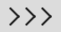

# Google CodeLabs: Android Kotlin Fundamental course

## How to use

Explanation given in comment format. Follow repos in order.

1. (HelloWorld)[/HelloWorld]: Dice roll app

   1. Android app anatomy

      1. Lifecycle methods
      2. Layout inflation, View classes and objects
      3. File structure: activities, layouts, R file, Android manifest
      4. Listeners and callback methods
      5. Layouts: Linear layout, orientation, layout gravity

   2. `lateinit`, adding images, compatibility

      1. `lateinit var`: Minimize the calls to `findViewById()`. Allows global view references and late initialization while removing need of null checks.
      2. `tools:src`: Add placeholder image in layout file which is only visible in IDE. Its not added into app on compilation. Its helpful for development.
      3. Android SDK versions in `build.gradle(:app)`:

         - **compileSdkVersion**: Version used to compile app. It allows app to use new features.
         - **targetSdkVersion**: Most recent API you have tested your app against.
         - **minSdkVersion**: Minimum level to support.

      4. Backward compatibility
         **androidx** provides helper classes to ensure backward compatibility. It's an improvement over Android support library.

         Eg. to display vector images in older android versions instead of converting them to bitmap, use `vectorDrawables.useSupportLibrary`. In `<ImageView>` replace `android:src` with `app:srcCompat`.

      5. `app` namespace: Used in XML files for custom functionality not provided by core android framework. Eg. for vector drawables `app:srcCompat` was used.

2. [MyBasicActivity](/MyBasicActivity): Using and importing activity templates.

   > https://codelabs.developers.google.com/codelabs/kotlin-android-training-available-resources

3. [Sunflower](/Sunflower): Change app icon.

   > https://codelabs.developers.google.com/codelabs/kotlin-android-training-available-resources

4. [AboutMe](/AboutMe)

   1. Linear layout, ViewGroup, styles

      > https://codelabs.developers.google.com/codelabs/kotlin-android-training-linear-layout

      1. **ViewGroup**: A view that can hold other views, eg. `LinearLayout`, `ScrollView`.
      2. **Styles**: Font, text size, padding and other elements in layout files can be grouped as styles.

         ```xml
            <TextView
                android:id="@+id/name_text"
                android:fontFamily="@font/roboto"
                android:textSize="@dimen/text_size"
                android:textColor="@android:color/black"
                android:layout_width="match_parent"
                android:layout_height="wrap_content"
                android:text="@string/name"
                android:textAlignment="center" />
         ```

         To create style right click `<TextView`, then **refactor>style**.

         ```xml
            <TextView
                android:id="@+id/name_text"
                style="@style/NameStyle"
                android:layout_width="match_parent"
                android:layout_height="wrap_content"
                android:text="@string/name"
                android:textAlignment="center" />
         ```

   2. `visibility` attribute for hiding views
      - **visible**
      - **invisible**: Hides view, but it still takes up space.
      - **gone**: Hides view, and view does not take up any space.
        > https://codelabs.developers.google.com/codelabs/kotlin-android-training-interactivity

   3. **Data binding**: It is a more efficient alternative to `findViewById()`. It eliminates the need to traverse the view hierarchy multiple times. In data binding a common `Binding` holds reference to each view. This single object is used to access views.
      > https://codelabs.developers.google.com/codelabs/kotlin-android-training-data-binding-basics

      

    Data binding uses:
        1. Eliminate `findViewById()`
        2. Data binding to display data: Data is used to directly make a **data class** available to a view. Here `MyName` data class is used to provide name and nickname to `activity_main.xml`. Special `<data>`, `<variable>` and `@{}` syntax is used to pass a data class to the layout.
    
5. [ColorMyViews](/ColorMyViews): `ContraintLayout`

    > https://codelabs.developers.google.com/codelabs/kotlin-android-training-constraint-layout

   1. **Constraint layout widget**: Can be used to set margins, bias and constraint type.

      

      - Margins: Drop down menu.
      - Bias: Sliders at left and bottom side.
      - Constraint type:

        1.  **Wrap content**: Expand only as much needed to fill contents.

        2.  **Fixed**: Fixed distance based on specified value.

        3.  **Match constraints**: View expands as much as possible to meet the constraints on each side.

   2. **Chains**: A chain is a group of views linked together by bidirectional constraints. Chains can be horizontal or vertical. The leftmost view in horizontal chain and topmost view in vertical chain is called the **head**.

       
    
       Chains have 3 styles which can be set using `layout_constraintHorizontal_chainStyle` or `layout_constraintVertical_chainStyle` parameter in the head view.
    
       1. **Spread**(default): Views are evenly spread in the available space, after margins are accounted for.
          
    
       2. **Spread inside**: First and the last views are attached to the parent on each end of the chain. The rest are evenly spread.
          
    
       3. **Packed**: Views are packed together, after margins are accounted for.
          

   3. **Design time attributes**: They're only displayed during layout design and are ignored at runtime. They're helpful for designing. They begin with `tools` namespace.
   
   4. **Baseline constraints**: Aligns baseline of one view's text with baseline of another view's text. This means text is always aligned, even when font sizes are different. This is done using `app:layout_constraintBaseline_toBaselineOf` attribute. To do this from design menu, right click the view and click on **show baseline**.
   
6. (AndroidTrivia-Starter)[/AndroidTrivia-Starter]: Fragments
    1. **Fragment**: A fragment is a sub-activity which can be reused in other activities. It has its own lifecycle events, layout file and kotlin class. Fragments can be added or removed when an activity is removed. Fragments are comparable to react components.
        > https://codelabs.developers.google.com/codelabs/kotlin-android-training-create-and-add-fragmen
    
        To inflate fragment, add binding to fragment's `onCreateView()`:
        
        ```kotlin
        override fun onCreateView(inflater: LayoutInflater, container: ViewGroup?,
                                  savedInstanceState: Bundle?): View? {
            // Inflate the layout for this fragment
            val binding = DataBindingUtil.inflate<FragmentTitleBinding>(inflater, R.layout.fragment_title, container, false)
            return binding.root
        }
        ```
