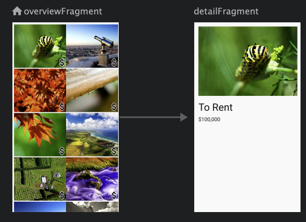

# Google CodeLabs: Android Kotlin Fundamental course

## How to use

Explanation given in comment format. Follow repos in order.

1. (HelloWorld)[/HelloWorld]: Dice roll app

   1. Android app anatomy

      1. Lifecycle methods
      2. Layout inflation, View classes and objects
      3. File structure: activities, layouts, R file, Android manifest
      4. Listeners and callback methods
      5. Layouts: Linear layout, orientation, layout gravity

   2. `lateinit`, adding images, compatibility

      1. `lateinit var`: Minimize the calls to `findViewById()`. Allows global view references and late initialization while removing need of null checks.
      2. `tools:src`: Add placeholder image in layout file which is only visible in IDE. Its not added into app on compilation. Its helpful for development.
      3. Android SDK versions in `build.gradle(:app)`:

         - **compileSdkVersion**: Version used to compile app. It allows app to use new features.
         - **targetSdkVersion**: Most recent API you have tested your app against.
         - **minSdkVersion**: Minimum level to support.

      4. Backward compatibility
         **androidx** provides helper classes to ensure backward compatibility. It's an improvement over Android support library.

         Eg. to display vector images in older android versions instead of converting them to bitmap, use `vectorDrawables.useSupportLibrary`. In `<ImageView>` replace `android:src` with `app:srcCompat`.

      5. `app` namespace: Used in XML files for custom functionality not provided by core android framework. Eg. for vector drawables `app:srcCompat` was used.

2. [MyBasicActivity](/MyBasicActivity): Using and importing activity templates.

   > https://codelabs.developers.google.com/codelabs/kotlin-android-training-available-resources

3. [Sunflower](/Sunflower): Change app icon.

   > https://codelabs.developers.google.com/codelabs/kotlin-android-training-available-resources

4. [AboutMe](/AboutMe)

   1. Linear layout, ViewGroup, styles

      > https://codelabs.developers.google.com/codelabs/kotlin-android-training-linear-layout

      1. **ViewGroup**: A view that can hold other views, eg. `LinearLayout`, `ScrollView`.
      2. **Styles**: Font, text size, padding and other elements in layout files can be grouped as styles.

         ```xml
            <TextView
                android:id="@+id/name_text"
                android:fontFamily="@font/roboto"
                android:textSize="@dimen/text_size"
                android:textColor="@android:color/black"
                android:layout_width="match_parent"
                android:layout_height="wrap_content"
                android:text="@string/name"
                android:textAlignment="center" />
         ```

         To create style right click `<TextView`, then **refactor>style**.

         ```xml
            <TextView
                android:id="@+id/name_text"
                style="@style/NameStyle"
                android:layout_width="match_parent"
                android:layout_height="wrap_content"
                android:text="@string/name"
                android:textAlignment="center" />
         ```

   2. `visibility` attribute for hiding views
      - **visible**
      - **invisible**: Hides view, but it still takes up space.
      - **gone**: Hides view, and view does not take up any space.
        > https://codelabs.developers.google.com/codelabs/kotlin-android-training-interactivity

   3. **Data binding**: It is a more efficient alternative to `findViewById()`. It eliminates the need to traverse the view hierarchy multiple times. In data binding a common `Binding` holds reference to each view. This single object is used to access views.
      > https://codelabs.developers.google.com/codelabs/kotlin-android-training-data-binding-basics

      

    Data binding uses:
        1. Eliminate `findViewById()`
        2. Data binding to display data: Data is used to directly make a **data class** available to a view. Here `MyName` data class is used to provide name and nickname to `activity_main.xml`. Special `<data>`, `<variable>` and `@{}` syntax is used to pass a data class to the layout.

        **Binding adapters**: Look at recycler view section.

5. [ColorMyViews](/ColorMyViews): `ContraintLayout`

    > https://codelabs.developers.google.com/codelabs/kotlin-android-training-constraint-layout

   1. **Constraint layout widget**: Can be used to set margins, bias and constraint type.

      

      - Margins: Drop down menu.
      - Bias: Sliders at left and bottom side.
      - Constraint type:

        1.  **Wrap content**: Expand only as much needed to fill contents.

        2.  **Fixed**: Fixed distance based on specified value.

        3.  **Match constraints**: View expands as much as possible to meet the constraints on each side.

   2. **Chains**: A chain is a group of views linked together by bidirectional constraints. Chains can be horizontal or vertical. The leftmost view in horizontal chain and topmost view in vertical chain is called the **head**.

       

       Chains have 3 styles which can be set using `layout_constraintHorizontal_chainStyle` or `layout_constraintVertical_chainStyle` parameter in the head view.

       1. **Spread**(default): Views are evenly spread in the available space, after margins are accounted for.
          

       2. **Spread inside**: First and the last views are attached to the parent on each end of the chain. The rest are evenly spread.
          

       3. **Packed**: Views are packed together, after margins are accounted for.
          

   3. **Design time attributes**: They're only displayed during layout design and are ignored at runtime. They're helpful for designing. They begin with `tools` namespace.

   4. **Baseline constraints**: Aligns baseline of one view's text with baseline of another view's text. This means text is always aligned, even when font sizes are different. This is done using `app:layout_constraintBaseline_toBaselineOf` attribute. To do this from design menu, right click the view and click on **show baseline**.

6. (AndroidTrivia-Starter)[/AndroidTrivia-Starter]: Fragments
    1. **Fragment**: A fragment is a sub-activity which can be reused in other activities. It has its own lifecycle events, layout file and kotlin class. Fragments can be added or removed when an activity is removed. Fragments are comparable to react components.
        > https://codelabs.developers.google.com/codelabs/kotlin-android-training-create-and-add-fragmen

        To inflate fragment, add binding to fragment's `onCreateView()`:

        ```kotlin
        override fun onCreateView(inflater: LayoutInflater, container: ViewGroup?,
                                  savedInstanceState: Bundle?): View? {
            // Inflate the layout for this fragment
            val binding = DataBindingUtil.inflate<FragmentTitleBinding>(inflater, R.layout.fragment_title, container, false)
            return binding.root
        }
        ```
    2. **Navigation**: Android navigator is a standard library to navigate between fragments.
        1. Import navigation library from Gradle(see committed code).
        2. Right click res > new > Android resource file > navigation. Navigation folder is generated which contains navigation xml file. It provides a GUI to setup navigation between different fragments.
        3. **Navigation host fragment**: It acts as host to navigate between fragments, swapping them in and out as necessary. Add `NavHostFragment` to `activity_main.xml`. `app:defaultNavHost` true sets it as default host, allowing it to intercept back button.

            ```xml
           <fragment
              android:id="@+id/myNavHostFragment"
              android:name="androidx.navigation.fragment.NavHostFragment"
              android:layout_width="match_parent"
              android:layout_height="match_parent"
              app:navGraph="@navigation/navigation"
              app:defaultNavHost="true"/>
           ```
        4. **Back stack**: Each time a user navigates to a new destination, the destination is added to the back stack. When back button is pressed, the topmost destination is popped and the user is taken there. Pop behavior can be modified in 2 ways:
            1. `popUpTo`: Pops up the stack up to the specified destination. This is exclusive of the specified destination.
            2. `popUpToInclusive`: If true, the specified destination is also popped. If this is set to app's starting location, then user is taken out of app if back button is pressed.
                ```xml
                <fragment
                   android:id="@+id/gameFragment"
                   android:name="com.example.android.navigation.GameFragment"
                   android:label="GameFragment"
                   tools:layout="@layout/fragment_game" >
                   <action
                       android:id="@+id/action_gameFragment_to_gameOverFragment"
                       app:destination="@id/gameOverFragment"
                       app:popUpTo="@id/titleFragment"
                       app:popUpToInclusive="true" />
                </fragment>
                ```

             `popUpTo` can be used to edit back button behavior
                1. Take user to title fragment and not game fragment when back button is pressed from game won / game over fragment.
                2. When user selects play again but then presses back button, he should be taken to title screen and not game over fragment.

        5. **Up button navigation**:
            - Up button is the `<-` button present in top app bar/action bar. Navigation wise it's similar to bottom back button but never takes the user out of the app.
            - It's implemented using `NavigationUI` library. Call `NavigationUI.setupActionBarWithNavController` and pass `navController` as a parameter. `navController` object is obtained from navigation host fragment. Finally listen to the up button and navigate behind by overriding `onSupportNavigationUp()` lifecycle function.

                ```kotlin
              override fun onSupportNavigateUp(): Boolean {
                      return navController.navigateUp()
                  }
              ```

        6. **Options menu**: It is the 3 dot menu on right side of the app bar. It opens a drop down menu. It's generally used to navigate to help or about screen.
            1. Add `aboutFragment` to navigator.
            2. Right click res > new resource > menu. Name it `options_menu`.
            3. Open `options_menu` in design view and add new `menu item`. Name it as `aboutFragment`.
            4. In [`TitleFragment.kt`](AndroidTrivia-Starter/app/src/main/java/com/example/android/navigation/TitleFragment.kt
) Enable options menu, override lifecycle functions for menu creation and button click.

        7. **Navigation drawer**: Opened using the hamburger icon / nav drawer icon.
            1. Import material library to access nav drawer. Add to app level `build.gradle`.
               ```
               implementation "com.google.android.material:material:$supportlibVersion"
               ```
            2. Add `RulesFragment` to navigator.
            3. Right click res > new resource > menu. Name it `navdrawer_menu`. This is a regular menu like from previous step which has 2 menu items- `aboutFragment` and `rulesFragment`. Display icons by passing them as parameters.
            4. Add `DrawerLayout` and `NavigationView` to [`activity_main.xml`](AndroidTrivia-Starter/app/src/main/res/layout/activity_main.xml).
            5. In [`MainActivity.kt`](AndroidTrivia-Starter/app/src/main/java/com/example/android/navigation/MainActivity.kt) connect drawer to navigation controller. Pass navigation view as parameter to `NavigationUI` in `onSupportNavigateUp()` to navigate user to selected fragment.

    3. **Pass data between fragments**
        > https://codelabs.developers.google.com/codelabs/kotlin-android-training-start-external-activity

        1. Add safe args plugin to Gradle. This adds type safety when passing data between fragments or activities. It is a better alternative to passing bundles. This generates `GameFragmentDirections` class.
        2. For navigation, action ID can be replaced with a directions class method.
            ```kotlin
            view.findNavController().navigate((GameFragmentDirections.actionGameFragmentToGameOverFragment()))
            ```
        3. To pass type safe parameters, open `navigation.xml` in design view. Open `gameWonFragment` attributes box and add required arguments.
            ```xml
            <fragment
                android:id="@+id/gameWonFragment"
                android:name="com.example.android.navigation.GameWonFragment"
                android:label="fragment_game_won"
                tools:layout="@layout/fragment_game_won" >
                <action
                    android:id="@+id/action_gameWonFragment_to_gameFragment"
                    app:destination="@id/gameFragment"
                    app:popUpTo="@id/titleFragment" />
                <!--Mandatory arguments-->
                <argument
                    android:name="numQuestions"
                    app:argType="integer" />
                <argument
                    android:name="numCorrect"
                    app:argType="integer" />
            </fragment>
            ```
        4. Pass `numQuestions` and `numCorrect` arguments when navigating to `gameWonFragment` from `gameFragment`.
            ```kotlin
           view.findNavController().navigate(GameFragmentDirections.actionGameFragmentToGameWonFragment(numQuestions, questionIndex))
            ```
        5. Receive the arguments
            ```kotlin
            val args = GameWonFragmentArgs.fromBundle(arguments!!)
            Toast.makeText(context, "numQuestions: ${args.numQuestions}, numCorrect: ${args.numCorrect}", Toast.LENGTH_SHORT).show()
            ```

    4. **Pass data to external activities using intents**: Intent is a message used to communicate between android components. It can be used for inter-app communication. In **inplicit intents** the destination activity is not specified. Android either opens the default app or allows user to choose one. This is useful for share functionality.
        1. In [GameWonFragment](AndroidTrivia-Starter/app/src/main/java/com/example/android/navigation/GameWonFragment.kt) use `setHasOptionsMenu()`, `onCreateOptionsMenu()` and `onOptionsItemSelected()` to show `winner_menu`.
        2. When user presses share button, launch a new intent which contains the message to be shared.

7. [DessertClicker-Starter](DessertClicker-Starter)
    1. Lifecycles and logging
        > https://codelabs.developers.google.com/codelabs/kotlin-android-training-lifecycles-logging
        > https://codelabs.developers.google.com/codelabs/kotlin-android-training-complex-lifecycle

        1. **Android Lifecycles** Activities and fragments have lifecycles where they undergo state changes. Callbacks are invoked when they transition. Callback operations can be overridden to allow programmability.
            1. **Activity lifecycle**

                

            2. **Fragment lifecycle**

                

            3. **`super.onCreate()` and other `super` functions**: `super` is used to execute code from the overridden method in addition to our own code. This step is necessary.

        2. **Timber logger**: Improvement over Android's basic logger. Setup steps
            1. Import in app level `build.gradle`
                ```kotlin
                implementation 'com.jakewharton.timber:timber:4.7.1'
                ```
            2. Create Application class [`ClickerApplication`](DessertClicker-Starter/app/src/main/java/com/example/android/dessertclicker/ClickerApplication.kt): `Application` is a base class which holds global app state. Its the main object used by OS to interact with the app. Timber needs to initialize logging through this class.
            3. Set `ClickerApplication` as Application class in `AndroidManifest.xml`.
                ```xml
                <application
                        android:name=".ClickerApplication"
                ```
            4. Replace `Log.i` with `Timber.i` in [`MainActivity`](DessertClicker-Starter/app/src/main/java/com/example/android/dessertclicker/MainActivity.kt)

        3. **Lifecycle use cases**:
            1. Activity is opened:
                ```
                onCreate() -> onStart() -> onResume()
                ```
            1. Closing activity and opening it again: App closed either by swiping or by using back button.
                ```
                onPause() -> onStop() -> onDestroy() -> onCreate() -> onStart() -> onResume()
                ```
            2. Navigating away and back from the activity: App is put in background using home button or when another activity is brought to the foreground. Here `onRestart()` takes the place of `onDestroy()` and `onCreate()`. It can be used to run code when activity is not started for the first time.
                ```
                onPause() -> onStop() -> onRestart() -> onStart() -> onResume()
                ```
             3. **Started vs Resumed states**: App is visible in *started state*. Whereas in *resumed state* the app is in focus and user can interact with it. Activity is said to be in **interactive lifecycle** when it is in *resumed state*. Eg. When share button is clicked the activity remains visible but loses focus.

                
                ```
                onPause() -> onResume()
                ```

        4. **Fragment lifecycle**: Refer next app

        5. **Avoid memory leaks**: Resources created in a lifecycle callback should be pulled down in the opposing callback. Eg. If a resource is started in `onStart()`, destroy it in `onStop()`.

        6. **Lifecycle library**: It lets us shift control from the activity or fragment to the actual component that needs to be lifecycle aware. Instead of calling start and stop timer functions from lifecycle callbacks, we have these functions observe and react to lifecycle changes.
            1. **Lifecycle owner**: Components which have their own lifecycle, i.e. activities and fragments. They implement the `LifecycleOwner` interface.
            2. **Lifecycle class**: Contains lifecycle state. It is passed by the lifecycle owner to the component implementing lifecycle library.
            3. **Lifecycle observer**: Components which observe and react to lifecycle state change. They implement `LifecycleObserver` interface. Here `DesserTimer` is the lifecycle observer.

         The lifecycle observer functions are triggered using annotations:

        ```kotlin
        @OnLifecycleEvent(Lifecycle.Event.ON_STOP)
        fun stopTimer() {
            // Removes all pending posts of runnable from the handler's queue, effectively stopping the
            // timer
            handler.removeCallbacks(runnable)
        }
        ```

        7. **App shutdown and `onSaveInstanceState()`**: Android can shut down background app processes to conserve resources. But to the user it doesn't look like the app has been closed. When user navigates back to the app, android restarts the app. However any data displayed by the app to user is lost. Eg. here deserts sold becomes 0. Also the app's `onDestroy()` method is never called on termination, making it unsuitable for backups.

            To simulate app termination, put app to background and run shell script:

            ```sh
            adb shell am kill com.example.android.dessertclicker
            ```

           The **Bundle object** `savedInstanceState` is used to protect data from termination. **Bundle** is stored in RAM and is useful for minimized apps only. Its not a persistent database. `onSaveInstanceState()` and `onCreate()` callbacks are used to save and read bundle respectively. The `onSaveInstanceState()` callback is called after `onStop()` and receives bundle object as a parameter.

            

            By default android stores some views in the bundle. Custom variables need to be added by user.

            1. To save data
            ```kotlin
            /**
             * Save custom data to bundle. This callback is triggered when app is minimized.
             */
            override fun onSaveInstanceState(outState: Bundle?) {
                outState?.putInt(KEY_REVENUE, revenue)
                outState?.putInt(KEY_DESSERT_SOLD, dessertsSold)
                outState?.putInt(KEY_TIMER_SECONDS, dessertTimer.secondsCount)
                super.onSaveInstanceState(outState)

                Timber.i("onSaveInstanceState Called")
            }
            ```

           2. To retrieve data in `onCreate()`
           ```kotlin
           override fun onCreate(savedInstanceState: Bundle?) {
               super.onCreate(savedInstanceState)

               // Retrieve saved data from bundle
               if(savedInstanceState != null) {
                   revenue = savedInstanceState.getInt(KEY_REVENUE, 0)
                   dessertsSold = savedInstanceState.getInt(KEY_DESSERT_SOLD, 0)
                   dessertTimer.secondsCount = savedInstanceState.getInt(KEY_TIMER_SECONDS, 0)
                   showCurrentDessert() // Update image based on dessertsSold count
               }
           ```

        App configuration changes like **screen rotation**, language change etc change the device state radically. Android then shuts down and restarts the app. To preserve data, `onSaveInstanceState()` can be used.


8. [AndroidTrivia-Fragment-Lifecycle](AndroidTrivia-Fragment-Lifecycle)

    

    Fragment lifecycle is similar to activity lifecycle with some additional functions. Description tells when these functions are called.
    1. `onAttach()`: Fragment attached to activity.
    2. `onCreate()`: Fragment created.
    3. `onCreateView()`: View inflated into fragment.
    4. `onActivityCreated()`: Called when owner activity's `onCreate()` is complete.
    5. `onStart()`: Fragment is visible.
    6. `onResume()`: Fragment is in focus.
    7. `onPause()`: Fragment loses focus.
    8. `onStop()`: Fragment loses visibility.
    9. `onDestroyView()`: View destroyed.
    10. `onDestroy()`: Fragment destroyed.
    11. `onDetach()`: Fragment detached from activity.

    When user moves to a new fragment, the current fragment is not destroyed. Only the view is destroyed. This can be seen when user navigates back to this fragment
    ```
    onPause() -> onStop() -> onDestroyView() -> onCreateView() -> onActivityCreated() -> onStart() -> onResume()
    ```

9. [GuessTheWord-Starter](GuessTheWord-Starter)
    1. **Android app architecture, ViewModel and ViewModelFactory**
        > https://codelabs.developers.google.com/codelabs/kotlin-android-training-view-model

        1. **Android App clean architecture**: It is based on separation of concerns:

            

            1. **UI controller**: Includes activity and fragment. It should only perform UI handling- displaying views, accepting inputs etc. It shouldn't have decision making logic.

            2. **ViewModel**:
                - Every ViewModel is associated with a UI controller. It holds data to be displayed. It performs calculations and executes decision-making logic.
                - Unlike fragment or activity, `ViewModel` is not destroyed when app configuration changes. Hence data is stored here for persistence.
                - But `ViewModel` remains within scope of the fragment, i.e. if current fragment is detached then ViewModel is destroyed.

            3. **ViewModelFactory**: Instantiates `ViewModel` objects.

        2. **ViewModel creation using ViewModelProvider**
            1. Create [GameVIewModel.kt](GuessTheWord-Starter/app/src/main/java/com/example/android/guesstheword/screens/game/GameViewModel.kt)
            2. Initialize `viewModel` in `GameFragment` using `ViewModelProvider`. This ensures that existing viewModel instance is reused when UI controller is destroyed and recreated.
                ```
                Log.i("GameFragment", "Called ViewModelProvider")
                viewModel = ViewModelProvider(this).get(GameViewModel::class.java)
                ```

                When screen is rotated, GameViewModel is reused and not called again.
                ```
                07-11 18:51:41.667 16315-16315/com.example.android.guesstheword I/GameFragment: Called ViewModelProviders.of
                07-11 18:51:41.669 16315-16315/com.example.android.guesstheword I/GameViewModel: GameViewModel created!
                07-11 18:52:21.421 16315-16315/com.example.android.guesstheword I/GameFragment: Called ViewModelProviders.of
                07-11 18:52:27.228 16315-16315/com.example.android.guesstheword I/GameFragment: Called ViewModelProviders.of
                07-11 19:12:30.803 16315-16315/com.example.android.guesstheword I/GameFragment: Called ViewModelProviders.of
                ```

               

        3. Move data and data processing to ViewModel: Now displayed data persists after screen rotation. ViewModel is a better alternative to Bundle for persisting data across lifecycle changes. Bundles have size limitations as well.

        4. **ViewModelFactory**: A factory method is a method which returns an object. Factory method pattern lets us instantiate `ViewModel` objects with parameters. This is not possible with just `ViewModelProvider`. Here we instantiate `ScoreViewModel` by passing score parameter to `ScoreViewModelFactory`.

            ```kotlin
            viewModelFactory = ScoreViewModelFactory(ScoreFragmentArgs.fromBundle(arguments!!).score)
            viewModel = ViewModelProvider(this, viewModelFactory).get(ScoreViewModel::class.java)
            binding.scoreText.text = viewModel.score.toString()
            ```
    2. **LiveData**

        > https://codelabs.developers.google.com/codelabs/kotlin-android-training-live-data

        1. Theory

            

            - LiveData is an observable data class used to change UI automatically when data changes.
            - It is a wrapper class that can hold data of any type.
            - Observers are used to react to `LiveData` observables.
            - It's lifecycle-aware. It only updates observers when app is in `STARTED` or `RESUMED` state.

        2. Add `LiveData` and observers
            - Update [`GameViewModel`](GuessTheWord-Starter/app/src/main/java/com/example/android/guesstheword/screens/game/GameViewModel.kt) with `MutableLiveData` observables. Update references to `word` and `score` with `word.value` and `score.value`.

                ```kotlin
                val word = MutableLiveData<String>() // Mutable because value can change
                val score = MutableLiveData<Int>()
                ```

            - Add observers to `GameFragment`

                ```kotlin
                /** viewLifecycleOwner
                 * Pass reference to the fragment view and not fragment itself. The both have different
                 * lifecycles. Fragment views are destroyed when user navigates away, but not fragment itself.
                 */
                viewModel.word.observe(viewLifecycleOwner, Observer {
                    newWord -> binding.wordText.text = newWord
                })
                /**
                 * Observers help in decoupling. We don't need to update UI manually when correct or skip
                 * button is pressed. UI is automatically updated when word or score are updated.
                 */
                viewModel.score.observe(viewLifecycleOwner, Observer {
                    newScore -> binding.scoreText.text = newScore.toString()
                })
                ```

            - Remove `updateWordText()` and `updateScoreText()` functions. They're not needed because UI will now be automatically updated.

        3. **LiveData encapsulation**: Encapsulate `LiveData` to provide read-only access to outside classes.

            ```kotlin
            /** Encapsulation
             * Only this class has write access to _word and _score. These MutableLiveData fields are private.
             * Outside classes should have read-only access. word and score are public but of LiveData type.
             * LiveData fields can't be modified.
             */
            private val _word = MutableLiveData<String>() // Mutable because value can change
            // Pass value using Kotlin getter
            val word: LiveData<String> // Not mutable
                get() = _word

            private val _score = MutableLiveData<Int>()
            val score: LiveData<Int>
                get() = _score
            ```

        4. Add observable and observer for for game end event. Game ends when words are exhausted.
        5. `LiveData` to show score and restart game

    2. **Data binding with `LiveData` and `ViewModel`**: We connect ViewModel directly to view via data binding instead of using fragments as an intermediary.
        1. **Listener binding**: Directly bind listener methods in `ViewModel` to XML view buttons. This removes need of setting listeners in Fragments.
            1. Pass `viewModel` as a data class to XML view
                - In `game_fragment.xml`

                    ```xml
                    <layout xmlns:android="http://schemas.android.com/apk/res/android"
                        xmlns:app="http://schemas.android.com/apk/res-auto"
                        xmlns:tools="http://schemas.android.com/tools">

                        <data>
                            <variable
                                name="gameViewModel"
                                type="com.example.android.guesstheword.screens.game.GameViewModel" />
                        </data>
                    ```
                - In `GameFragment.xml`
                    ```kotlin
                    binding.gameViewModel = viewModel
                    ```

            2. Listener binding: Bind button click listener to `viewModel` methods.

                ```xml
                <Button
                    android:id="@+id/skip_button"
                    android:onClick="@{() -> gameViewModel.onSkip()}" />
                ```

            3. Remove click handlers from fragment.

                ```kotlin
                binding.skipButton.setOnClickListener { onSkip() }
                ```

        2. **LiveData and data binding**: Data binding can allow LiveData present in `ViewModel` to automatically update binding without need of observers.

                1. Assign fragment view as binding's lifecycle owner

                    ```kotlin
                    binding.lifecycleOwner = viewLifecycleOwner
                    ```

                2. Access LiveData variables in view

                    ```
                    <TextView
                        android:id="@+id/score_text"
                        android:text="@{scoreViewModel.score.toString()}" />
                    ```

                3. Remove observer

                    ```kotlin
                    viewModel.score.observe(viewLifecycleOwner, Observer {
                        newScore -> binding.scoreText.text = newScore.toString()
                    })
                    ```

         3. String formatting
            1. Add template to `strings.xml`
                ```xml
                <string name="score_format">Current Score: %d</string>
                ```

            2. Use template to `game_fragment.xml`
                ```
                android:text="@{@string/score_format(gameViewModel.score)}"
                ```

    2. **LiveData transformations**: Transformations allow us to perform manipulations on one `LiveData` object and return a new `LiveData` object. It is comparable to `map()` operation in JavaScript.

        **Properties**
            - Transformations run in the UI thread so shouldn't be used for computationally intensive tasks.
            - Transformations are not calculated unless an observer function is observing the transformed `LiveData`.

        1. In [`GameViewModel.kt`](GuessTheWord-Starter/app/src/main/java/com/example/android/guesstheword/screens/game/GameViewModel.kt)
        ```kotlin
        /** Display remaining game time to user. Game ends when time becomes 0 **/
        private val _currentTime = MutableLiveData<Long>()
        // Map time in MM:SS format
        val currentTime: LiveData<String>
            get() = Transformations.map(_currentTime) {
                DateUtils.formatElapsedTime(it)
            }
        ```

       2. Use the transformed string `LiveData` in [`game_fragment.xml`](GuessTheWord-Starter/app/src/main/res/layout/game_fragment.xml)
       ```xml
       <TextView
           android:id="@+id/timer_text"
           android:text="@{gameViewModel.currentTime}" />
       ```

10. [TrackMySleepQuality-Starter](TrackMySleepQuality-Starter)
    1. **Room database**:
        > https://codelabs.developers.google.com/codelabs/kotlin-android-training-room-database

        1. **Theory**
            - Room is an abstraction library over SQLite.
            - It helps us handle:
                1. **Entity**: Represents an object and its properties stored in the database. Each entity is a row and every property is a column. An **entity class** defines a table. Each entity is defined as an **annotated data class**.
                2. **Query**: Used for CRUD operations. Database interactions are defined using a **data access object(DAO)**. DAO provides convenience methods for CRUD operations. It's is created using an **annotated interface**.

        2. **Create entity using data class**: Room provides annotations to create entities. Look at [`SleepNight.kt`](TrackMySleepQuality-Starter/app/src/main/java/com/example/android/trackmysleepquality/database/SleepNight.kt)
            1. `@Entity`: Holds table name
            2. `@PrimaryKey`: Define a field as primary key
            3. `@Entity`: Create column for given field

        3. **Create DAO**: Room provides annotations for creating DAO. Look at [`SleepDatabaseDao.kt`](TrackMySleepQuality-Starter/app/src/main/java/com/example/android/trackmysleepquality/database/SleepDatabaseDao.kt)
            1. `@Dao`: All DAOs need to be annotated with this.
            2. `@Insert`, `@Update`, `@Delete`: Convenience annotations. `@Update` and `@Delete` work for single items and need primary key.
            3. `@Query`: Run ad-hoc queries

        4. **Database creation**: `@Database` generates database, entities and DAOs. Look at [`SleepDatabase.kt`](TrackMySleepQuality-Starter/app/src/main/java/com/example/android/trackmysleepquality/database/SleepDatabase.kt)

    2. **Coroutines**:
        > https://codelabs.developers.google.com/codelabs/kotlin-android-training-coroutines-and-room

        1. Theory:
            - Coroutines provide a way to perform long-running asynchronous tasks in a non-blocking manner. Non-blocking means that the UI thread is not blocked, giving a smooth experience.
            - Like async await in Javascript, they help convert callback based code to sequential code.
            - **Suspend functions**: Coroutines execute functions with `suspend` keyword. When a `suspend` function is called, the calling thread is suspended. **Suspended thread** is different from **blocked thread**. The suspended thread is free to perform other tasks until the function returns a result.
                
            - Suspend functions can run on the UI thread or in a background thread.
            - Coroutines have 3 parts:
                1. **Job**: They're tasks that can be cancelled. Jobs can be arranged in a parent-child hierarchy. Cancelling the parent job cancels all its children.
                2. **Dispatcher**: It sends off coroutines to run on different threads. Eg. `Dispatcher.Main` runs on main thread.
                3. **Scope**: Contains information about job and dispatcher. It keeps track of coroutines and defines the context in which they run.

        2. **Implementation**: Use [`SleepTrackerViewModel`](TrackMySleepQuality-Starter/app/src/main/java/com/example/android/trackmysleepquality/sleeptracker/SleepTrackerViewModel.kt) to access database and update UI using coroutines. A general pattern is seen here:
            1. Launch coroutine in main/UI thread. This is because `SleepTrackerViewModel` has to update UI.
            2. Call suspend function for long running tasks so UI thread is not blocked.
            3. Run the suspend function code in separate thread using IO dispatcher. This is because suspend function only accesses database, it has nothing to do with UI.

            ```kotlin
            fun someWorkNeedsToBeDone() {
               uiScope.launch {

                    suspendFunction()

               }
            }

            suspend fun suspendFunction() {
               withContext(Dispatchers.IO) {
                   longrunningWork()
               }
            }
            ```

           Alternatively `suspend` function's code can be directly added to the coroutine

           ```kotlin
            fun someWorkNeedsToBeDone() {
               uiScope.launch {
                    withContext(Dispatchers.IO) {
                       longrunningWork()
                    }
               }
            }
           ```

    3. **Recycler view**
        > https://codelabs.developers.google.com/codelabs/kotlin-android-training-recyclerview-fundamentals

        1. **Theory**: Recycler view is an efficient way to display large lists in Android
            1. Only processes items currently displayed on screen.
            2. When an item scrolls off the screen, its view is recycled by another screen.
            3. Recycler view uses adapter pattern

                

        2. **Adapter pattern**: It helps an object work with another API. `RecyclerView` uses adapter pattern to transform app data into something it can display, without changing how the data is stored or processed.

        3. `RecyclerView` needs the following:

            

            1. Data to display
            2. `RecyclerView` instance in layout file: Acts as a container for views.
            3. A layout file for item displayed by `RecyclerView`: Multiple layouts can be used in same `RecyclerView`.
            4. **Layout manager**: Tells how to position items of the `RecyclerView`. Android provides layout managers like `LinearLayoutManager` which lays items in a full width vertical list.
            5. **View holder**: Contains information to be displayed. It extends the `ViewHolder` class.
            6. **Adapter**: Connects data to `RecyclerView` and adapts it into a displayable format.

        4. Implementation
            1. Add `RecyclerView` to [`fragment_sleep_tracker.xml`](TrackMySleepQuality-Starter/app/src/main/res/layout/fragment_sleep_tracker.xml). Set `LayoutManager` to `LinearLayoutManager`:

                ```
                app:layoutManager="androidx.recyclerview.widget.LinearLayoutManager"
                ```

            2. Create [`text_item_view.xml`](TrackMySleepQuality-Starter/app/src/main/res/layout/text_item_view.xml) which holds the layout of items to be displayed.

            3. Create text view holder `TextItemViewHolder` in [`Util.kt`](TrackMySleepQuality-Starter/app/src/main/java/com/example/android/trackmysleepquality/Util.kt)

            4. Create adapter [`SleepNightAdapter`](TrackMySleepQuality-Starter/app/src/main/java/com/example/android/trackmysleepquality/sleeptracker/SleepNightAdapter.kt) based on `TextItemViewHolder`. Create `data` variable which holds data to be displayed and a setter to update it.

                ```kotlin
                var data = listOf<SleepNight>()
                set(value) { // Setter to replace data
                    field = value
                    notifyDataSetChanged() // RecyclerView redraws list with new data when this is called
                }
                ```

                Override 3 methods needed by `RecyclerView`:
                    1. `getItemCount()`
                    2. `onCreateViewHolder()`: Returns inflated view holder.
                    3. `onBindViewHolder()`: Returns data for item at specified position. It can perform conditional operations on individual items:

                        ```kotlin
                        override fun onBindViewHolder(holder: TextItemViewHolder, position: Int) {
                            val item = data[position]
                            holder.textView.text = item.sleepQuality.toString()
                            if(item.sleepQuality in listOf<Int>(0, 1)) { // Display red text for low sleep score
                                holder.textView.setTextColor(Color.RED)
                            }
                        }
                        ```

            5. In [`SleepTrackerFragment`](TrackMySleepQuality-Starter/app/src/main/java/com/example/android/trackmysleepquality/sleeptracker/SleepNightAdapter.kt) pass data to adapter and connect it to `RecyclerView`.

                ```kotlin
                // Initialize adapter
                val adapter = SleepNightAdapter()
                // Pass LiveData into adapter
                sleepTrackerViewModel.nights.observe(this, Observer {nights ->
                    nights?.let {
                        adapter.data = nights
                    }
                })
                // Connect RecyclerView with adapter
                binding.sleepList.adapter = adapter
                ```

        6. **Custom view holder**: Earlier `RecyclerView` displayed a simple text list using a `TextView` based view holder and layout. To customize what is displayed:

            

            1. Create custom view layout [`list_item_sleep_night.xml`](TrackMySleepQuality-Starter/app/src/main/res/layout/list_item_sleep_night.xml)

                

            2. Create custom `ViewHolder` in [`SleepNightAdapter`](TrackMySleepQuality-Starter/app/src/main/java/com/example/android/trackmysleepquality/sleeptracker/SleepNightAdapter.kt) or in a separate file

                ```kotlin
                class ViewHolder(itemView: View): RecyclerView.ViewHolder(itemView) {
                    val sleepLength: TextView = itemView.findViewById(R.id.sleep_length)
                    val quality: TextView = itemView.findViewById(R.id.quality_string)
                    val qualityImage: ImageView = itemView.findViewById(R.id.quality_image)
                }
                ```

            3. Use the `ViewHolder` and layout in [`SleepNightAdapter`](TrackMySleepQuality-Starter/app/src/main/java/com/example/android/trackmysleepquality/sleeptracker/SleepNightAdapter.kt)

        7. Code improvements: Refactor code so that logic related to `ViewHolder` lies in `ViewHolder` class only. Look at [`SleepNightAdapter.kt` file](TrackMySleepQuality-Starter/app/src/main/java/com/example/android/trackmysleepquality/sleeptracker/SleepNightAdapter.kt).

            1. `from()` method: Return inflated `ViewHolder` object to adapter's `onCreateViewHolder()` method. This function should be callable from `ViewHolder` class so it's added in a companion object.
            2. `bind()` method: Binds data to `ViewHolder` object at specified position. It's called from the `ViewHolder` object received by `onBindViewHolder()` method.
            3. Make `ViewHolder` class' constructor private. It's not publicly used since `ViewHolder` instances are created by `from()` method.

        8. **`DiffUtil` and `RecyclerView`**
            > https://codelabs.developers.google.com/codelabs/kotlin-android-training-diffutil-databinding

            Earlier `RecyclerView` data was updated using `notifyDataSetChanged()` in [`SleepNightAdapter`](TrackMySleepQuality-Starter/app/src/main/java/com/example/android/trackmysleepquality/sleeptracker/SleepNightAdapter.kt). But this is an inefficient method which invalidates entire list to have it redrawn.

            ```kotlin
            var data = listOf<SleepNight>()
            set(value) { // Setter to replace data
                field = value
                notifyDataSetChanged() // RecyclerView redraws list with new data when this is called
            }
            ```

           Recycler view's `DiffUtil` class provides a better solution. It uses **Eugene Myer's diff algorithm** to turn the old list into the new list with minimal number of changes. This algorithm is also used in git.

            **Implementation**:

            1. Create callback class [`SleepNightDiffCallback`](TrackMySleepQuality-Starter/app/src/main/java/com/example/android/trackmysleepquality/sleeptracker/SleepNightAdapter.kt) to check diff.
            2. Make [`SleepNightAdapter` class](TrackMySleepQuality-Starter/app/src/main/java/com/example/android/trackmysleepquality/sleeptracker/SleepNightAdapter.kt) inherit `ListAdapter` class. This class provides automated way to read and update data. `SleepNightAdapter` class takes `SleepNightDiffCallback` as callback.
            3. Use `ListAdapter`'s submit method to pass updated list from [`SleepTrackerFragment`](TrackMySleepQuality-Starter/app/src/main/java/com/example/android/trackmysleepquality/sleeptracker/SleepTrackerFragment.kt)

                ```kotlin
                sleepTrackerViewModel.nights.observe(this, Observer {nights ->
                    nights?.let {
                        adapter.submitList(nights) // ListAdapter provides function to update list
                    }
                })
                ```

        9. **Binding adapters**: They extend data binding functionality by allowing *custom attributes* in XML layout files. They're an alternative to transformation based data binding for complex data.

            1. Define binding adapters in [`BindingUtils.kt`](TrackMySleepQuality-Starter/app/src/main/java/com/example/android/trackmysleepquality/sleeptracker/BindingUtils.kt) using `@BindingAdapter` annotation

                ```kotlin
                @BindingAdapter("sleepDurationFormatted")
                fun TextView.setSleepDurationFormatted(item: SleepNight) {
                    text = convertDurationToFormatted(item.startTimeMilli, item.endTimeMilli, context.resources)
                }
                ```

            2. Use adapter in [`list_item_sleep_night.xml`](TrackMySleepQuality-Starter/app/src/main/res/layout/list_item_sleep_night.xml)

                ```xml
                <TextView app:sleepQualityString="@{sleepNight}" />
                ```

        10. **Grid layout using layout manager**:
            - Grid layout can either be scrolled in vertical(default) or horizontal direction.
            - It arranges items in rows and columns.
            - **Span**: Span count defines
                - Number of columns in a row for vertical(default) scroll; or
                - Number of rows in a column for horizontal scroll

                We can set up the number of spans taken by an items for custom behavior. Eg. an item 3 span wide in a 3 span grid view occupies the entire row.

            **To set up Grid layout**
            1. Remove `LinearLayoutManager` from [`fragment_sleep_tracker.xml`](TrackMySleepQuality-Starter/app/src/main/res/layout/fragment_sleep_tracker.xml).
            2. Setup `GridLayoutManager` in [`SleepTrackerFragment`](TrackMySleepQuality-Starter/app/src/main/java/com/example/android/trackmysleepquality/sleeptracker/SleepTrackerFragment.kt).
                ```kotlin
                val manager = GridLayoutManager(activity, 3) // 3 span wide grid layout
                ```
            3. Update view holder layout in [`list_item_sleep_night.xml`](TrackMySleepQuality-Starter/app/src/main/res/layout/list_item_sleep_night.xml).

        11. **Handle clicks in recycler view**
            1. Use data binding to pass click handler to view layout [`list_item_sleep_night.xml`](TrackMySleepQuality-Starter/app/src/main/res/layout/list_item_sleep_night.xml):
                - Add variable
                    ```xml
                    <variable
                        name="clickListener"
                        type="com.example.android.trackmysleepquality.sleeptracker.SleepNightClickListener" />
                    ```

                - Consume listener
                    ```xml
                    <androidx.constraintlayout.widget.ConstraintLayout
                        android:onClick="@{() -> clickListener.onClick(sleepNight)}">
                    ```

            2. Create a click handler class `SleepNightClickListener` which accepts a lambda function as parameter. This function is executed by calling the class's `onClick()` method.
                ```kotlin
                class SleepNightClickListener(val clickListener: (nightId: Long) -> Unit) {
                    fun onClick(night: SleepNight) = clickListener(night.nightId)
                }
                ```
            3. Adapter's constructor takes an instance of `SleepNightClickListener` as input. This instance is passed to `onBindViewHolder()` function.
                ```kotlin
                class SleepNightAdapter(private val clickListener: SleepNightClickListener): ListAdapter<SleepNight, ViewHolder>(SleepNightDiffCallback()) {
                    override fun onBindViewHolder(holder: ViewHolder, position: Int) {
                        val item = getItem(position) // getItem() provided by ListAdapter
                        holder.bind(item, clickListener)
                    }
                }
                ```
            4. Update view holders' `bind()` method to take `clickListener` as a parameter and bind it to the view:
                ```kotlin
                fun bind(item: SleepNight, clickListener: SleepNightClickListener) {
                    binding.clickListener = clickListener
                ```
            5. Pass lambda function when instantiating adapter in [`SleepTrackerFragment`](TrackMySleepQuality-Starter/app/src/main/java/com/example/android/trackmysleepquality/sleeptracker/SleepTrackerFragment.kt)
                ```kotlin
                val adapter = SleepNightAdapter(SleepNightClickListener {
                    nightId -> Toast.makeText(context, "$nightId", Toast.LENGTH_SHORT).show()
                })
                ```

        12. **Headers in Recycler view**: Headers can be implemented in 2 ways:
            1. Make adapter detect any specific index for header(like 0). Display header here. This is the preferred approach.
            2. Modify data list to add header data at required positions: Not good practice.

            **Implementation**(see [`SleepNightAdapter.kt`](TrackMySleepQuality-Starter/app/src/main/java/com/example/android/trackmysleepquality/sleeptracker/SleepNightAdapter.kt)):

            1. Separate data classes and view holders are used to represent:
                1. **Header**: `Header` data class and `TextViewHolder` view holder is used.

                    ```kotlin
                    class HeaderViewHolder(view: View): RecyclerView.ViewHolder(view) {
                        companion object {
                            fun from(parent: ViewGroup): HeaderViewHolder {
                                val layoutInflater = LayoutInflater.from(parent.context)
                                val view = layoutInflater.inflate(R.layout.header, parent, false)
                                return HeaderViewHolder(view)
                            }
                        }
                    }
                    ```

                2. **Sleep nights**: `SleepNightItem` data class and `ViewHolder` view holder is used.

                    ```kotlin
                    class SleepNightViewHolder private constructor(private val binding: ListItemSleepNightBinding): RecyclerView.ViewHolder(binding.root) {
                        companion object {
                            fun from(parent: ViewGroup): SleepNightViewHolder {
                                val layoutInflater = LayoutInflater.from(parent.context) // Used to inflate XML layouts
                                val binding = ListItemSleepNightBinding.inflate(layoutInflater, parent, false)
                                return SleepNightViewHolder(binding)
                            }
                        }

                        fun bind(item: SleepNight, clickListener: SleepNightClickListener) {
                            binding.sleepNight = item
                            binding.clickListener = clickListener
                            binding.executePendingBindings() // Optimization for RecyclerView
                        }
                    }
                    ```

            2. `Header` and `SleepNightItem` are children of the `DataItem` class.

                ```kotlin
                /** Sealed class: All subclasses must be declared within its body. This prevents bugs. **/
                sealed class DataItem {
                    abstract val id: Long

                    data class SleepNightItem(val sleepNight: SleepNight): DataItem() {
                        override val id = sleepNight.nightId
                    }

                    // Header as object because only one instance is needed.
                    object Header: DataItem() {
                        override val id = Long.MIN_VALUE // So header ID never conflicts with sleep item ID
                    }
                }
                ```

            3. Use this common parent class `DataItem` to update the signature of the adapter and diff function.

                ```kotlin
                class SleepNightAdapter(private val clickListener: SleepNightClickListener): ListAdapter<DataItem, RecyclerView.ViewHolder>(SleepNightDiffCallback()) {}
                ```

                ```kotlin
                class SleepNightDiffCallback: DiffUtil.ItemCallback<DataItem>() {
                    /** Return true if items are same **/
                    override fun areItemsTheSame(oldItem: DataItem, newItem: DataItem): Boolean {
                        return oldItem.id == newItem.id
                    }

                    /** Return true if contents of items are same **/
                    override fun areContentsTheSame(oldItem: DataItem, newItem: DataItem): Boolean {
                        return oldItem == newItem
                    }

                }
                ```

            4. Override `getItemViewType()` to allow adapter to differentiate between header and sleep sleep data. Here `ITEM_VIEW_TYPE_HEADER` and `ITEM_VIEW_TYPE_ITEM` can be any constants. This function assigns `itemType` to each data item.

                ```kotlin
                override fun getItemViewType(position: Int): Int {
                    return when(getItem(position)) {
                        is DataItem.Header -> ITEM_VIEW_TYPE_HEADER
                        else -> ITEM_VIEW_TYPE_ITEM
                    }
                }
                ```

            8. In `onCreateViewHolder()` use `itemType` parameter inflate header and sleep data separately.

                ```kotlin
                override fun onCreateViewHolder(parent: ViewGroup, viewType: Int): RecyclerView.ViewHolder {
                    return when(viewType) {
                        ITEM_VIEW_TYPE_HEADER -> HeaderViewHolder.from(parent)
                        else -> SleepNightViewHolder.from(parent)
                    }
                }
                ```

            9. Finally insert header at 0th position in list using `addHeaderAndSubmitList()`. This function is called by [`SleepTrackerFragment`](TrackMySleepQuality-Starter/app/src/main/java/com/example/android/trackmysleepquality/sleeptracker/SleepTrackerFragment.kt) instead of ListAdapter's `submitList()`.

                ```kotlin
                fun addHeaderAndSubmitList(list: List<SleepNight>?) {
                    // Use coroutine for async operation
                    adapterScope.launch {
                        val items = when(list) {
                            null -> listOf(DataItem.Header)
                            else -> listOf(DataItem.Header) + list.map { DataItem.SleepNightItem(it) }
                        }
                        // Main thread used because UI has to be updated
                        withContext(Dispatchers.Main) {
                            submitList(items)
                        }
                    }
                }
                ```

            10. In [`SleepTrackerFragment`](TrackMySleepQuality-Starter/app/src/main/java/com/example/android/trackmysleepquality/sleeptracker/SleepTrackerFragment.kt)

                ```kotlin
                adapter.addHeaderAndSubmitList(it)
                ```

        13. **Selectively set span in RecyclerView grid layout**: Use `GridLayoutManager`'s `SpanSizeLookUp()` and `getSpanSize()` to increase width of header at 0th index:

                ```kotlin
                val manager = GridLayoutManager(activity, 3) // 3 span wide grid layout
                manager.spanSizeLookup = object: GridLayoutManager.SpanSizeLookup() {
                    // Assign 3 span width to heading at 0th index
                    override fun getSpanSize(position: Int): Int {
                        return when(position) {
                            0 -> 3
                            else -> 1
                        }
                    }
                }
                ```

11. [MarsRealEstate-Starter](MarsRealEstate-Starter)

    1. API calls with Retrofit
        > https://codelabs.developers.google.com/codelabs/kotlin-android-training-internet-data

        1. Implementation(look at [`MarsAPIService.kt`](MarsRealEstate-Starter/app/src/main/java/com/example/android/marsrealestate/network/MarsApiService.kt):
            1. Import retrofit in app level [`build.gradle`](MarsRealEstate-Starter/app/build.gradle)
            2. Initialize retrofit with base URL.
            3. Create interface `MarsApiService` to access endpoints using HTTP method annotations(GET, POST, DELETE etc)
            4. Create object to initialize retrofit. This object is used to make API calls.
            5. Consume API in [`OverviewViewModel`](MarsRealEstate-Starter/app/src/main/java/com/example/android/marsrealestate/overview/OverviewViewModel.kt) using a callback. This callback has 2 overrides for success and failure respectively.

                ```kotlin
                private fun getMarsRealEstateProperties() {
                    MarsApi.retrofitService.getProperties().enqueue( // Trigger callback when response is received
                            object : Callback<String> {
                                override fun onFailure(call: Call<String>, t: Throwable) {
                                    _response.value = "Failure: ${t.message}"
                                }
                                override fun onResponse(call: Call<String>, response: Response<String>) {
                                    _response.value = response.body()
                                }
                            })
                }
                ```

            6. Provide internet permission in [`AndroidManifest.xml`](MarsRealEstate-Starter/app/src/main/AndroidManifest.xml)
            
                ```xml
                <uses-permission android:name="android.permission.INTERNET" />
                ```

        2. Parse JSON with `moshi`
            1. Import moshi in app level [`build.gradle`](MarsRealEstate-Starter/app/build.gradle)
            2. Inspect JSON data and create data class [`MarsProperty`](MarsRealEstate-Starter/app/src/main/java/com/example/android/marsrealestate/network/MarsProperty.kt)
            3. Initialize moshi and integrate with Retrofit using `MoshiConvertorFactory` in [`MarsApiService`](MarsRealEstate-Starter/app/src/main/java/com/example/android/marsrealestate/network/MarsApiService.kt)

                ```kotlin
                private val moshi = Moshi.Builder()
                        .add(KotlinJsonAdapterFactory())
                        .build()
                
                private val retrofit = Retrofit.Builder()
                        .addConverterFactory(MoshiConverterFactory.create(moshi))
                        .baseUrl(BASE_URL)
                        .build()
                ```

            4. In `MarsApiService` refactor `getProperties()` to return list of `MarsProperty`

                ```kotlin
                @GET("realestate") // GET request to '/realestate' endpoint
                fun getProperties():
                        Call<List<MarsProperty>> // Return parsed list
                ```

            5. Refactor API call callback in [`OverviewViewModel`](MarsRealEstate-Starter/app/src/main/java/com/example/android/marsrealestate/overview/OverviewViewModel.kt) to process `List<MarsProperty>` data.

                ```kotlin
                MarsApi.retrofitService.getProperties().enqueue( // Trigger callback when response is received
                        object : Callback<List<MarsProperty>> {
                            override fun onFailure(call: Call<List<MarsProperty>>, t: Throwable) {
                                _response.value = "Failure: ${t.message}"
                            }
                            override fun onResponse(call: Call<List<MarsProperty>>, response: Response<List<MarsProperty>>) {
                                _response.value = "${response.body()?.size} Mars properties received"
                            }
                        })
                ```

        2. Retrofit with coroutines: This makes code cleaner by replacing callbacks with sequential code.
            1. Import retrofit coroutine library in app level [`build.gradle`](MarsRealEstate-Starter/app/build.gradle)
            2. Add `CoroutineCallAdapterFactory()` when building retrofit.
            3. In `MarsApiService` rename `getProperties()` as `getPropertiesAsync()`. Change return type from `Call` to `Deferred`.

                ```kotlin
                @GET("realestate") // GET request to '/realestate' endpoint
                fun getPropertiesAsync():
                        Deferred<List<MarsProperty>> // Replace Call with Deferred for coroutine support
                ```

            4. In [`OverviewViewModel`](MarsRealEstate-Starter/app/src/main/java/com/example/android/marsrealestate/overview/OverviewViewModel.kt) use coroutine to make API call. Replace callback with sequential code and try/catch for error handling.

                ```kotlin
                private fun getMarsRealEstateProperties() {
                    coroutineScope.launch {
                        // Start network call
                        val getPropertiesDeferred = MarsApi.retrofitService.getPropertiesAsync() // Retrofit works on background thread
                        try {
                            // await() returns result of network call. It is non-blocking
                            val listResult = getPropertiesDeferred.await()
                            _response.value = "${listResult.size} Mars properties received"
                        } catch (e: Exception) {
                            _response.value = "Failure: ${e.message}"
                        }
                    }
                }
                ```

    2. **Display images from internet with Glide**
        > https://codelabs.developers.google.com/codelabs/kotlin-android-training-internet-images

        **Implementation**
        1. Import glide in app level [`build.gradle`](MarsRealEstate-Starter/app/build.gradle)
        2. In [`BindingAdapters.kt`](MarsRealEstate-Starter/app/src/main/java/com/example/android/marsrealestate/BindingAdapters.kt) Create binding adapter which takes URL string and calls Glide to fetch and display data.

            ```kotlin
            @BindingAdapter("imageUrl")
            fun bindImage(imageView: ImageView, imageUrl: String?) {
                // See if url is not null
                imageUrl?.let {
                    val imageUri = it.toUri().buildUpon().scheme("https").build()
            
                    Glide.with(imageView.context)
                            .load(imageUri)
                            .apply(RequestOptions() //optional- for loading placeholder and error image
                                    .placeholder(R.drawable.loading_animation)
                                    .error(R.drawable.ic_broken_image))
                            .into(imageView)
                }
            }
            ```

        3. In [`OverviewViewModel`](MarsRealEstate-Starter/app/src/main/java/com/example/android/marsrealestate/overview/OverviewViewModel.kt) create `LiveData` field `property` to store first item from `MarsData` list.

            ```kotlin
            if(listResult.isNotEmpty()) {
                _property.value = listResult[0]
            }
            ```

        4. In [`grid_view_item.xml`](MarsRealEstate-Starter/app/src/main/res/layout/grid_view_item.xml) use binding adapter to display image.

            ```xml
                <ImageView
                    android:id="@+id/mars_image"
                    app:imageUrl="@{viewModel.property.imgSrcUrl}" />
            ```

        5. In [`OverviewFragment`](MarsRealEstate-Starter/app/src/main/java/com/example/android/marsrealestate/overview/OverviewFragment.kt) inflate `grid_view_item` using data binding. Now image will be displayed.

            ```kotlin
            val binding = GridViewItemBinding.inflate(inflater)
            ```

         !()[https://codelabs.developers.google.com/codelabs/kotlin-android-training-internet-images/img/144df3c58ea3ce44.png]

    3. **Display images in grid `RecyclerView`**

        Method is similar to the one used in `RecyclerView` codelab. But code can be made more readable in following ways:
        
        1. In [`BindingAdapters.kt`](MarsRealEstate-Starter/app/src/main/java/com/example/android/marsrealestate/BindingAdapters.kt) use binding adapter `listData` to adapter with data.

            ```kotlin
            @BindingAdapter("listData")
            fun bindRecyclerView(recyclerView: RecyclerView, data: List<MarsProperty>?) {
                data?.let {
                    val adapter = recyclerView.adapter as PhotoGridAdapter
                    adapter.submitList(data)
                }
            }
            ```

        2. Use layout file [`fragment_overview.xml`](MarsRealEstate-Starter/app/src/main/res/layout/fragment_overview.xml) to set `GridLayoutManager`, `spanCount` and `listData` binding adapter.

            ```xml
            <androidx.recyclerview.widget.RecyclerView
                android:id="@+id/photos_grid"
                app:layoutManager="androidx.recyclerview.widget.GridLayoutManager"
                app:spanCount="2"
                app:listData="@{viewModel.properties}"
                tools:itemCount="16"
                tools:listitem="@layout/grid_view_item" />
            ```
           
            To setup adapter in `OverviewFragment` just use:
           
            ```kotlin
            binding.photosGrid.adapter = PhotoGridAdapter()
            ```

    4. **Display overlay image over image, use binding expressions**: Show `$` image over properties available for sale, i.e. not rental type.
        > https://codelabs.developers.google.com/codelabs/kotlin-android-training-internet-filtering

        
        
        1. In [`MarsProperty`](MarsRealEstate-Starter/app/src/main/java/com/example/android/marsrealestate/network/MarsProperty.kt) add `isRental` variable to see if property is of type 'rent'.
        2. In [`grid_view_item.xml`](MarsRealEstate-Starter/app/src/main/res/layout/grid_view_item.xml) add `<import>` statement in `<data>` tags. It allows us to import classes for evaluating **binding expressions** like `android:visibility="@{marsProperty.rental ? View.GONE : View.VISIBLE}"` in XML layout files.
        3. `FrameLayout`: It is used to display views in a stacked manner. `$` symbol image will be stacked over Mars property image.

            ```xml
                <FrameLayout
                    android:layout_width="match_parent"
                    android:layout_height="170dp">
                    <ImageView
                        android:id="@+id/mars_image"
                        android:layout_width="match_parent"
                        android:layout_height="170dp"
                        android:scaleType="centerCrop"
                        android:adjustViewBounds="true"
                        android:padding="2dp"
                        app:imageUrl="@{marsProperty.imgSrcUrl}"
                        tools:src="@tools:sample/backgrounds/scenic"/>
            
                    <!-- Display $ sign if property is for sale(not rental) -->
                    <ImageView
                        android:id="@+id/mars_property_type"
                        android:layout_width="wrap_content"
                        android:layout_height="45dp"
                        android:layout_gravity="bottom|end"
                        android:adjustViewBounds="true"
                        android:padding="5dp"
                        android:scaleType="fitCenter"
                        android:src="@drawable/ic_for_sale_outline"
                        android:visibility="@{marsProperty.rental ? View.GONE : View.VISIBLE}" />
                </FrameLayout>
            ```

    5. **Add navigation to real estate app with parcelable object for safe args**: The steps are similar to those used in `RecyclerView` click handling tutorial earlier.

        

        1. In [`OverviewFragment`](MarsRealEstate-Starter/app/src/main/java/com/example/android/marsrealestate/overview/OverviewFragment.kt) pass lambda click handler when setting up adapter. Bind this click handler to `RecyclerView` view holder.
        2. Click handler changes value of a `LiveData` value in `OverviewViewModel`. An observer observes this change and navigates to `DetailFragment`.
        3. A `MarsProperty` object is passed as an argument to `DetailFragment` when navigating. But a class must be made **parcelable** to be used as navigation safe args. In [`MarsProperty`](MarsRealEstate-Starter/app/src/main/java/com/example/android/marsrealestate/network/MarsProperty.kt) use `@Parcelize` annotation and extend `Parcelable` class.

            ```kotlin
            @Parcelize
            data class MarsProperty(
                    val id: String,
                    @Json(name = "img_src") val imgSrcUrl: String, // Rename received attribute using camel case
                    val type: String,
                    val price: Double
            ) : Parcelable {
                val isRental
                    get() = type == "rent"
            }
            ```

13. [DevBytes-starter](DevBytes-starter)

    1. **Repository pattern and caching**:
        > https://codelabs.developers.google.com/codelabs/kotlin-android-training-repository

        1. Theory: Caching in android is performed using SQLite and Room. **Separation of concerns principle** should be applied when using caching:

            

            - **Repository class**: It isolates data sources(online and offline) from rest of the app, providing a clean API to access data. It contains logic on when to fetch data from internet and when to use cache. Repository is part of the MVVM pattern.
            - Maintain separate network, domain and database objects.

        2. **Implementation**
            1. Create database entities, DAO and Room database in [`DatabaseEntities.kt`](DevBytes-starter/app/src/main/java/com/example/android/devbyteviewer/database/DatabaseEntities.kt) and [`Room.kt`](DevBytes-starter/app/src/main/java/com/example/android/devbyteviewer/database/Room.kt). This database acts as cache.
            2. In [`DatabaseEntities.kt`](DevBytes-starter/app/src/main/java/com/example/android/devbyteviewer/database/DatabaseEntities.kt) and [`DataTransferObjects.kt`](DevBytes-starter/app/src/main/java/com/example/android/devbyteviewer/network/DataTransferObjects.kt) add functions to transform database, domain and network objects into one another.
            3. In [`VideosRepository.kt`](DevBytes-starter/app/src/main/java/com/example/android/devbyteviewer/repository/VideosRepository.kt) create repository. It has function `refreshVideos()` to fetch data from internet and update cache. The repository has attribute `videos` which returns a `LiveData` list of domain objects.
            4. In `DevByteViewModel.kt` remove API call logic. Fetch `LiveData` from repository instead and display to user. Refresh repository data when view model is initialized using `init{}` constructor.

    2. **`WorkManager` for background tasks**
        > https://codelabs.developers.google.com/codelabs/kotlin-android-training-work-manager

        1. **Theory**
            - `WorkManager` is an android architecture component for performing background tasks.
            - It's used for work that is deferrable, i.e. not required to run immediately. Eg. send analytics to server.
            - It ensures **guaranteed execution**, i.e. task will run even when app exits or device restarts.
            - `WorkManager` library has 3 classes:
                1. `Worker`: Contains code to be executed in background. This class is extended by our class and the `doWork()` method is overridden. The `CoroutineWorker` class is a `Worker` child class used to run worker using coroutines.
                2. `WorkRequest`: Allows us to set criteria on when a background task runs. Battery status, network status, charge state etc can be used as criteria. Work request can either be one-off(using `OneTimeWorkRequest` class) or periodic(using `PeriodicWorkRequest` class). The **minimum interval for periodic requests is 15 minutes**.
                3. `WorkManager`: Schedules and runs the `WorkRequest`. But exact execution time is subject to system optimizations.
            - Workers get max 10 minutes to complete execution. Beyond this the worker is forcefully stopped.

        2. **Implementation**:
            1. Add `WorkManager` dependency in app level [`build.gradle`](DevBytes-starter/app/build.gradle)
            2. Create [`RefreshDataWorker`](DevBytes-starter/app/src/main/java/com/example/android/devbyteviewer/DevByteApplication.kt) and make it extend `CoroutineWorker`. This `Worker` contains code for updating repository in background. Create a constant `WORKER_NAME` in a companion object. This is a unique name needed by `WorkManager` to identify scheduled work.

                ```kotlin
                class RefreshDataWorker(appContext: Context, params: WorkerParameters): CoroutineWorker(appContext, params) {
                    companion object {
                        // Every scheduled work request must have a unique name
                        const val WORK_NAME = "com.example.android.devbyteviewer.work.RefreshDataWorker"
                    }
                    override suspend fun doWork(): Result {
                        /** Repository makes API calls and stores data in cache. It acts as data source **/
                        val videosRepository = VideosRepository(getDatabase(applicationContext))
                        try {
                            videosRepository.refreshVideos()
                        } catch (e: HttpException) {
                            Timber.d("video refresh failed, retrying")
                            return Result.retry()
                        }
                        Timber.d("videos refreshed")
                        return Result.success()
                    }
                }
                ```
               
                Here the `doWork()` function must return a `ListenableWorker.Result` object:
                    1. `Result.success()`: Work completed successfully.
                    2. `Result.failure()`: Work completed with permanant failure.
                    3. `Result.retry()`: Work encountered a transient failure and should be retried.

            3. Create a periodic work request in [`DevByteApplication.kt`](DevBytes-starter/app/src/main/java/com/example/android/devbyteviewer/DevByteApplication.kt). Enqueue this work request with `WorkManager`. Work requests are made from the `Application` class because this class is run first when the app start.

                ```kotlin
                    private fun setupRecurringWork() {
                        // Repeat periodic request every 15 minutes
                        val repeatingRequest = PeriodicWorkRequestBuilder<RefreshDataWorker>(15, TimeUnit.MINUTES)
                                .build()
                
                        // KEEP policy: if pending work exists with same name, discard new work
                        WorkManager.getInstance().enqueueUniquePeriodicWork(
                                RefreshDataWorker.WORK_NAME,
                                ExistingPeriodicWorkPolicy.KEEP,
                                repeatingRequest
                        )
                    }
                ```

            4. Use a coroutine in [`DevByteApplication`'s](DevBytes-starter/app/src/main/java/com/example/android/devbyteviewer/DevByteApplication.kt) `onCreate()` method to execute the worker function `setupRecurringWork()`. This is so that main thread is not blocked during scheduling.

                ```kotlin
                override fun onCreate() {
                    super.onCreate()
                    applicationScope.launch {
                        // Initialize Timber and worker in coroutine so as not to block the main thread
                        Timber.plant(Timber.DebugTree())
                        setupRecurringWork()
                    }
                }
                ```

        3. **Set system constraints for executing work**: Scheduled work will be executed only when constraints are met.

            ```kotlin
            val constraints = Constraints.Builder()
                    .setRequiresBatteryNotLow(true)
                    .build()

            val repeatingRequest = PeriodicWorkRequestBuilder<RefreshDataWorker>(15, TimeUnit.MINUTES)
                    .setConstraints(constraints)
                    .build()
            ```

14. [GDGFinder-Starter](GDGFinder-Starter)

    1. **Styles and themes**
        > https://codelabs.developers.google.com/codelabs/kotlin-android-training-styles-and-themes

        1. **Android styling system**: Android has a pyramidal style system. Styling techniques at the top have higher precedence than those at bottom.

            

            1. **View attributes**: Specified explicitly for each view. Use for one-off designs or for customization.
            2. **Style**: Create collection of reusable styling information.
            3. **Default style**: Provided by android system.
            4. **Theme**: Used to define colors, fonts etc for whole app.
            5. **Text appearance**: For font only.

        2. **Add downloadable fonts**: They're downloaded by app at runtime. Open design view > font > More button > More fonts > Select desired font and select "create downloadable font". This adds font file in `res/font` and imports it in `AndroidManifest.xml` using `preloaded_fonts` file.

            ```xml
            <meta-data
                android:name="preloaded_fonts"
                android:resource="@array/preloaded_fonts" />
            ```

        3. **Add font to app theme**: This applies font to entire app. In `styles.xml` add attributes to `AppTheme` style. App theme font can be overridden by using a view attribute.

            ```xml
            <style name="AppTheme" parent="Theme.MaterialComponents.Light.NoActionBar">
                <!-- Customize your theme here. -->
                <item name="colorPrimary">@color/colorPrimary</item>
                <item name="colorPrimaryDark">@color/colorPrimaryDark</item>
                <item name="colorAccent">@color/colorAccent</item>
                <item name="fontFamily">@font/lobster_two</item>
                <item name="android:fontFamily">@font/lobster_two</item>
            </style>
            ```

        4. **Styles**:
            - They're defined in [`styles.xml`](GDGFinder-Starter/app/src/main/res/values/styles.xml)
            - **Naming convention**: Name style based on the attribute to which it'll be assigned. Eg. to set `android:textAppearance` field of a `TextView` name the style as `TextAppearance.anyName`.
            
                ```xml
                <style name="TextAppearance.Title" parent="TextAppearance.MaterialComponents.Headline6">
                    <item name="android:textSize">24sp</item>
                    <item name="android:textColor">#555555</item>
                </style>
                ```

            This will be assigned to

                ```xml
                <TextView
                    android:id="@+id/subtitle"
                    android:textAppearance="@style/TextAppearance.Subtitle"
                ```

            - **Inheritance**: Styles can have other styles as parents. Eg. in above example `TextAppearance.Title` style is child of `TextAppearance.MaterialComponents.Headline6` style. User defined styles can also be used as parent styles. Eg. the `TextAppearance.Subtitle` inherits `TextAppearance.Title`.

            ```
            <style name="TextAppearance.Subtitle" parent="TextAppearance.Title">
                <item name="android:textSize">18sp</item>
            </style>
            ```

    2. **Material design**:
        > https://codelabs.developers.google.com/codelabs/kotlin-android-training-material-design-dimens-colors

        1. **Add floating action button**
            - In [`home_fragment.xml`](GDGFinder-Starter/app/src/main/res/layout/home_fragment.xml) wrap `ScrollView` with `FrameLayout`. `FrameLayout` allows views to be stacked on one another.
            - Replace `Scrollview` tag with `NestedScrollView`.
            - Add `FloatingActionButton` item below `NestedScrollView`. Add icon and padding to the FAB.
            - Set listener to the FAB using data binding.

        2. **Use material styles**:
            - In [`home_fragment.xml`](GDGFinder-Starter/app/src/main/res/layout/home_fragment.xml) apply style to title using `app:style="@style/TextAppearance.MaterialComponents.Headline5"`.
            - Shortcut for referencing values from current theme: Use `?attr/` for searching. Eg. `style="?attr/textAppearanceHeadline5"`.
            - **Overriding current theme styles**: Here we override `?attr/textAppearanceHeadline6`. In `styles.xml` create new style and make it inherit a material style. Override attributes as desired. Then add an item with `textAppearanceHeadline6` that references the created style.

                ```xml
                <style name="TextAppearance.CustomHeadline6" parent="TextAppearance.MaterialComponents.Headline6">
                    <item name="android:textSize">18sp</item>
                    <item name="textAppearanceHeadline6">@style/TextAppearance.CustomHeadline6</item>
                </style>
                ```
           
            This style can now be used as
    
                ```xml
                <TextView
                    android:id="@+id/subtitle"
                    style="?attr/textAppearanceHeadline6" />
                ```
